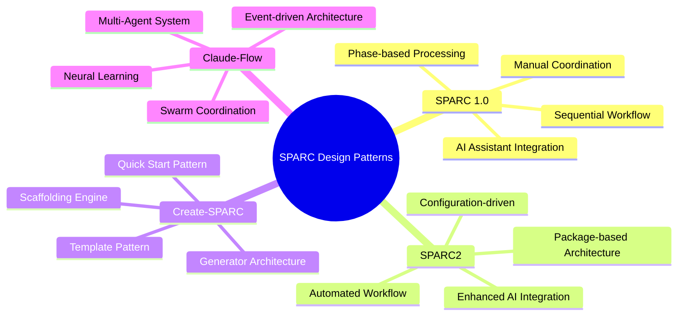
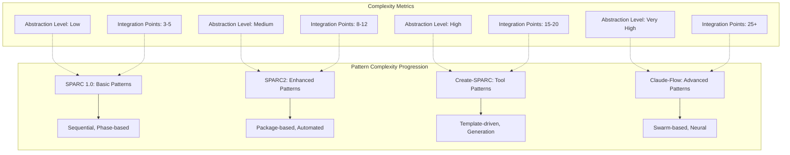
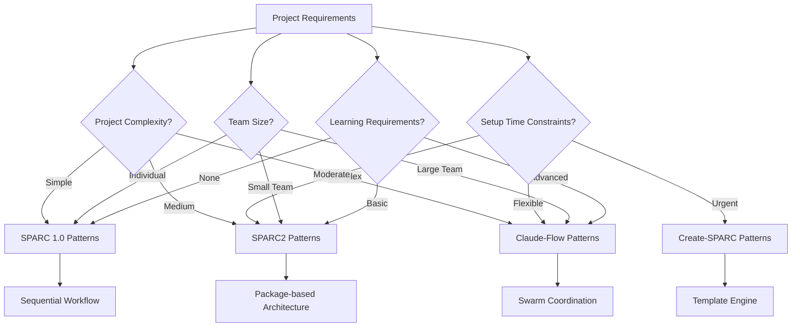
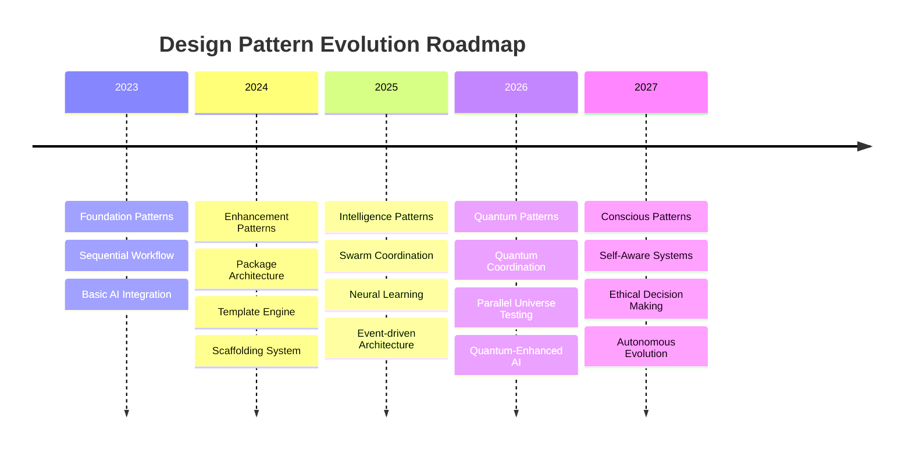

# SPARC Design Patterns Evolution

**Document Version:** 1.0  
**Date:** July 12, 2025  
**Architect:** Claude AI (Architect Worker 3)  
**Project:** SPARC Evolution Analysis & Educational Platform

---

## 1. Design Pattern Evolution Overview

### 1.1 Pattern Classification by Milestone



---

## 2. SPARC 1.0 Design Patterns

### 2.1 Sequential Workflow Pattern

**Intent:** Provide a structured, phase-based approach to AI-assisted development

```typescript
interface SequentialWorkflowPattern {
  phases: Phase[];
  currentPhase: number;
  context: DevelopmentContext;
  
  executePhase(phase: Phase): Promise<PhaseResult>;
  validatePhase(phase: Phase): ValidationResult;
  transitionToNext(): boolean;
}

class SPARCWorkflow implements SequentialWorkflowPattern {
  private phases: Phase[] = [
    new SpecificationPhase(),
    new PseudocodePhase(),
    new ArchitecturePhase(),
    new RefinementPhase(),
    new CompletionPhase()
  ];
  
  async execute(): Promise<ProjectResult> {
    for (const phase of this.phases) {
      const result = await this.executePhase(phase);
      if (!this.validatePhase(phase)) {
        throw new Error(`Phase ${phase.name} validation failed`);
      }
    }
    return this.generateFinalResult();
  }
}
```

**Benefits:**
- Clear structure and predictable flow
- Easy to understand and follow
- Maintains development discipline

**Limitations:**
- Rigid sequential execution
- Limited parallelization
- Manual coordination required

### 2.2 AI Assistant Integration Pattern

**Intent:** Seamlessly integrate AI assistance into each development phase

```typescript
interface AIAssistantPattern {
  assistant: AIAssistant;
  context: PhaseContext;
  
  generateSuggestions(input: string): Promise<Suggestion[]>;
  validateOutput(output: string): ValidationResult;
  refineResult(feedback: Feedback): Promise<string>;
}

class PhaseAIIntegration implements AIAssistantPattern {
  constructor(
    private phase: SPARCPhase,
    private assistant: AIAssistant
  ) {}
  
  async assistPhase(userInput: string): Promise<PhaseOutput> {
    const context = this.buildContext();
    const prompt = this.buildPrompt(userInput, context);
    const aiResponse = await this.assistant.query(prompt);
    
    return {
      content: aiResponse.content,
      suggestions: aiResponse.suggestions,
      confidence: aiResponse.confidence,
      metadata: this.extractMetadata(aiResponse)
    };
  }
}
```

### 2.3 Phase-based Processing Pattern

**Intent:** Encapsulate each SPARC phase as an independent, reusable component

```typescript
abstract class SPARCPhase {
  abstract name: string;
  abstract description: string;
  
  abstract execute(input: PhaseInput): Promise<PhaseOutput>;
  abstract validate(output: PhaseOutput): ValidationResult;
  
  protected buildContext(input: PhaseInput): PhaseContext {
    return {
      previousPhases: input.previousResults,
      currentRequirements: input.requirements,
      constraints: input.constraints,
      timestamp: Date.now()
    };
  }
}

class SpecificationPhase extends SPARCPhase {
  name = "Specification";
  description = "Define clear requirements and constraints";
  
  async execute(input: PhaseInput): Promise<PhaseOutput> {
    const requirements = await this.gatherRequirements(input);
    const constraints = await this.identifyConstraints(input);
    const objectives = await this.defineObjectives(input);
    
    return {
      requirements,
      constraints,
      objectives,
      quality: this.assessQuality(requirements, constraints, objectives)
    };
  }
}
```

---

## 3. SPARC2 Design Patterns

### 3.1 Package-based Architecture Pattern

**Intent:** Modularize SPARC methodology into reusable, configurable packages

```typescript
interface PackageArchitecturePattern {
  modules: SPARCModule[];
  configuration: SPARC2Config;
  dependencies: Dependency[];
  
  loadModule(name: string): Promise<SPARCModule>;
  configureWorkflow(config: WorkflowConfig): void;
  executeWorkflow(): Promise<WorkflowResult>;
}

class SPARC2Package implements PackageArchitecturePattern {
  private moduleRegistry = new Map<string, SPARCModule>();
  
  constructor(private config: SPARC2Config) {
    this.loadCoreModules();
    this.configureIntegrations();
  }
  
  async install(): Promise<void> {
    await this.resolveDependencies();
    await this.initializeModules();
    await this.setupConfiguration();
  }
  
  async createProject(template: ProjectTemplate): Promise<Project> {
    const workflow = this.buildWorkflow(template);
    const context = this.createContext(template);
    
    return await workflow.execute(context);
  }
}
```

### 3.2 Enhanced AI Integration Pattern

**Intent:** Provide sophisticated AI integration with multiple models and enhanced context

```typescript
interface EnhancedAIPattern {
  models: LLMModel[];
  router: ModelRouter;
  context: EnhancedContext;
  
  routeRequest(request: AIRequest): LLMModel;
  enhanceContext(context: BasicContext): EnhancedContext;
  processResponse(response: AIResponse): ProcessedResponse;
}

class EnhancedAIIntegration implements EnhancedAIPattern {
  constructor(
    private models: LLMModel[],
    private contextManager: ContextManager
  ) {}
  
  async processPhase(phase: SPARCPhase, input: PhaseInput): Promise<EnhancedPhaseOutput> {
    const enhancedContext = this.contextManager.enhance(input.context);
    const bestModel = this.selectOptimalModel(phase.type, enhancedContext);
    
    const response = await bestModel.process({
      phase: phase.name,
      context: enhancedContext,
      history: this.contextManager.getHistory(),
      preferences: this.contextManager.getPreferences()
    });
    
    return this.postProcess(response, enhancedContext);
  }
}
```

### 3.3 Automated Workflow Pattern

**Intent:** Automate SPARC workflow execution with minimal manual intervention

```typescript
interface AutomatedWorkflowPattern {
  triggers: WorkflowTrigger[];
  rules: AutomationRule[];
  executor: WorkflowExecutor;
  
  configureTriggers(triggers: WorkflowTrigger[]): void;
  addAutomationRule(rule: AutomationRule): void;
  executeAutomatically(): Promise<AutomationResult>;
}

class AutomatedSPARCWorkflow implements AutomatedWorkflowPattern {
  private automationEngine = new AutomationEngine();
  
  async setupAutomation(config: AutomationConfig): Promise<void> {
    // Configure phase transitions
    this.automationEngine.addRule({
      condition: "phase_completed",
      action: "start_next_phase",
      validation: "auto_validate"
    });
    
    // Configure AI assistance
    this.automationEngine.addRule({
      condition: "user_input_received",
      action: "generate_ai_suggestions",
      enhancement: "context_enrichment"
    });
    
    // Configure quality checks
    this.automationEngine.addRule({
      condition: "output_generated",
      action: "quality_assessment",
      feedback: "improvement_suggestions"
    });
  }
}
```

---

## 4. Create-SPARC Design Patterns

### 4.1 Template Engine Pattern

**Intent:** Generate project structures from configurable templates

```typescript
interface TemplateEnginePattern {
  templates: ProjectTemplate[];
  engine: TemplatingEngine;
  context: GenerationContext;
  
  loadTemplate(name: string): Promise<ProjectTemplate>;
  renderTemplate(template: ProjectTemplate, context: GenerationContext): RenderedProject;
  customizeTemplate(template: ProjectTemplate, customizations: Customization[]): ProjectTemplate;
}

class CreateSPARCTemplateEngine implements TemplateEnginePattern {
  private templateRegistry = new TemplateRegistry();
  
  async generateProject(templateName: string, options: ProjectOptions): Promise<GeneratedProject> {
    const template = await this.templateRegistry.load(templateName);
    const context = this.buildGenerationContext(options);
    
    // Process template files
    const files = await this.processTemplateFiles(template.files, context);
    
    // Generate configuration
    const config = await this.generateConfiguration(template.config, context);
    
    // Setup dependencies
    const dependencies = await this.resolveDependencies(template.dependencies, context);
    
    return {
      files,
      config,
      dependencies,
      metadata: this.generateMetadata(template, context)
    };
  }
}
```

### 4.2 Scaffolding Architecture Pattern

**Intent:** Provide rapid project initialization with pre-configured structures

```typescript
interface ScaffoldingPattern {
  scaffolds: Scaffold[];
  generator: ProjectGenerator;
  configurator: ProjectConfigurator;
  
  createScaffold(type: ProjectType): Promise<Scaffold>;
  applyScaffold(scaffold: Scaffold, target: string): Promise<void>;
  customizeScaffold(scaffold: Scaffold, customizations: CustomizationOptions): Scaffold;
}

class SPARCScaffoldingSystem implements ScaffoldingPattern {
  async quickStart(projectType: ProjectType, name: string): Promise<QuickStartResult> {
    const scaffold = await this.createOptimizedScaffold(projectType);
    const projectPath = await this.initializeProject(name);
    
    // Apply base structure
    await this.applyBaseStructure(scaffold, projectPath);
    
    // Configure SPARC workflow
    await this.configureSPARCWorkflow(scaffold.sparcConfig, projectPath);
    
    // Setup development environment
    await this.setupDevelopmentEnvironment(scaffold.devConfig, projectPath);
    
    // Generate initial documentation
    await this.generateDocumentation(scaffold.docTemplate, projectPath);
    
    return {
      projectPath,
      configuration: scaffold.sparcConfig,
      nextSteps: this.generateNextSteps(projectType)
    };
  }
}
```

### 4.3 Quick Start Pattern

**Intent:** Minimize time-to-productivity for new SPARC projects

```typescript
interface QuickStartPattern {
  presets: QuickStartPreset[];
  optimizer: StartupOptimizer;
  validator: SetupValidator;
  
  analyzeRequirements(input: UserInput): ProjectRequirements;
  selectOptimalPreset(requirements: ProjectRequirements): QuickStartPreset;
  executeQuickStart(preset: QuickStartPreset): Promise<ReadyProject>;
}

class SPARCQuickStart implements QuickStartPattern {
  async initializeProject(answers: UserAnswers): Promise<ProjectInitializationResult> {
    // Analyze user requirements
    const requirements = this.analyzeUserNeeds(answers);
    
    // Select optimal template and configuration
    const preset = this.selectBestPreset(requirements);
    
    // Generate project with optimal settings
    const project = await this.generateOptimizedProject(preset);
    
    // Validate setup
    const validation = await this.validateProjectSetup(project);
    
    // Provide getting started guide
    const guide = this.generateGettingStartedGuide(project, validation);
    
    return {
      project,
      validation,
      guide,
      estimatedSetupTime: this.calculateSetupTime(preset)
    };
  }
}
```

---

## 5. Claude-Flow Design Patterns

### 5.1 Swarm Coordination Pattern

**Intent:** Orchestrate multiple AI agents to work collaboratively on complex tasks

```typescript
interface SwarmCoordinationPattern {
  topology: SwarmTopology;
  agents: Agent[];
  coordinator: SwarmCoordinator;
  communication: CommunicationProtocol;
  
  initializeSwarm(config: SwarmConfig): Promise<Swarm>;
  coordinateTask(task: ComplexTask): Promise<TaskResult>;
  optimizeTopology(): Promise<OptimizedTopology>;
}

class ClaudeFlowSwarmCoordinator implements SwarmCoordinationPattern {
  async orchestrateProject(project: ProjectDefinition): Promise<ProjectResult> {
    // Initialize swarm with optimal topology
    const swarm = await this.initializeSwarm({
      topology: this.selectOptimalTopology(project.complexity),
      agentTypes: this.determineRequiredAgents(project.requirements),
      coordination: this.buildCoordinationStrategy(project.constraints)
    });
    
    // Decompose project into coordinated tasks
    const taskPlan = await this.decomposeTasks(project);
    
    // Execute tasks with swarm coordination
    const results = await this.executeCoordinatedTasks(swarm, taskPlan);
    
    // Synthesize final result
    return await this.synthesizeResults(results);
  }
}
```

### 5.2 Multi-Agent System Pattern

**Intent:** Enable specialized agents to collaborate through well-defined interfaces

```typescript
interface MultiAgentSystemPattern {
  agents: SpecializedAgent[];
  messageQueue: MessageQueue;
  sharedMemory: SharedMemory;
  conflictResolver: ConflictResolver;
  
  spawnAgent(type: AgentType, capabilities: Capability[]): Promise<SpecializedAgent>;
  facilitateCommunication(agents: SpecializedAgent[]): Promise<void>;
  resolveConflicts(conflicts: AgentConflict[]): Promise<Resolution[]>;
}

class SPARCMultiAgentSystem implements MultiAgentSystemPattern {
  async executeProjectWithAgents(project: ProjectDefinition): Promise<ProjectExecution> {
    // Spawn specialized agents
    const agents = await this.spawnSpecializedAgents([
      { type: 'researcher', capabilities: ['analysis', 'investigation'] },
      { type: 'architect', capabilities: ['design', 'planning'] },
      { type: 'coder', capabilities: ['implementation', 'testing'] },
      { type: 'reviewer', capabilities: ['quality_assurance', 'optimization'] }
    ]);
    
    // Establish communication protocols
    await this.establishCommunication(agents);
    
    // Execute project phases with agent collaboration
    const execution = await this.executeWithCollaboration(project, agents);
    
    return execution;
  }
}
```

### 5.3 Neural Learning Pattern

**Intent:** Enable the system to learn and improve from experiences

```typescript
interface NeuralLearningPattern {
  neuralNetwork: NeuralNetwork;
  trainingData: TrainingDataset;
  learningAlgorithm: LearningAlgorithm;
  adaptationEngine: AdaptationEngine;
  
  trainFromExperience(experiences: Experience[]): Promise<TrainingResult>;
  adaptBehavior(feedback: Feedback): Promise<AdaptationResult>;
  predictOptimalStrategy(context: ProjectContext): Promise<Strategy>;
}

class ClaudeFlowNeuralLearning implements NeuralLearningPattern {
  async improveFromProject(project: CompletedProject): Promise<LearningOutcome> {
    // Extract learning data from project
    const experience = this.extractExperience(project);
    
    // Train neural patterns
    const patterns = await this.identifySuccessPatterns(experience);
    
    // Update coordination strategies
    await this.updateCoordinationStrategies(patterns);
    
    // Improve agent capabilities
    await this.enhanceAgentCapabilities(patterns);
    
    // Store learned knowledge
    await this.persistLearning(patterns);
    
    return {
      patternsLearned: patterns.length,
      improvementMetrics: this.calculateImprovements(patterns),
      applicableContexts: this.identifyApplicableContexts(patterns)
    };
  }
}
```

### 5.4 Event-Driven Architecture Pattern

**Intent:** Enable loose coupling and real-time responsiveness through event-based communication

```typescript
interface EventDrivenPattern {
  eventBus: EventBus;
  eventHandlers: EventHandler[];
  eventStore: EventStore;
  
  publishEvent(event: Event): Promise<void>;
  subscribeToEvents(eventTypes: EventType[], handler: EventHandler): void;
  replayEvents(fromTimestamp: number): Promise<Event[]>;
}

class ClaudeFlowEventSystem implements EventDrivenPattern {
  async setupEventDrivenWorkflow(): Promise<void> {
    // Setup core event types
    this.defineEventTypes([
      'agent_spawned',
      'task_started',
      'task_completed',
      'conflict_detected',
      'performance_threshold_reached',
      'learning_opportunity_identified'
    ]);
    
    // Configure event handlers
    this.configureEventHandlers();
    
    // Enable event replay for recovery
    this.enableEventSourcing();
  }
  
  private configureEventHandlers(): void {
    this.eventBus.subscribe('task_completed', async (event) => {
      await this.updateProgress(event);
      await this.checkForNextTasks(event);
      await this.learnFromCompletion(event);
    });
    
    this.eventBus.subscribe('conflict_detected', async (event) => {
      await this.initiateConflictResolution(event);
      await this.notifyCoordinator(event);
    });
  }
}
```

---

## 6. Cross-Pattern Evolution Analysis

### 6.1 Pattern Complexity Evolution



### 6.2 Pattern Interaction Matrix

| Pattern Category | SPARC 1.0 | SPARC2 | Create-SPARC | Claude-Flow |
|------------------|-----------|--------|--------------|-------------|
| **Workflow Management** | Sequential | Automated | Template-driven | Event-driven |
| **AI Integration** | Basic Assistant | Enhanced Multi-model | Template-based | Swarm Intelligence |
| **Code Generation** | Manual | Package-based | Scaffolding | Multi-agent |
| **Quality Assurance** | Manual Review | Automated Testing | Template Validation | Neural Learning |
| **Performance** | Linear | Optimized | Fast Generation | Parallel Processing |
| **Adaptability** | Static | Configurable | Template-based | Self-learning |
| **Collaboration** | Individual | Package Sharing | Template Exchange | Multi-agent Swarm |

### 6.3 Pattern Benefits Evolution

```typescript
interface PatternBenefitsEvolution {
  sparc10: {
    clarity: "Clear methodology structure";
    predictability: "Predictable workflow";
    simplicity: "Easy to understand";
  };
  
  sparc2: {
    reusability: "Package-based reuse";
    automation: "Reduced manual work";
    consistency: "Standardized implementations";
  };
  
  createSparc: {
    productivity: "Rapid project setup";
    standardization: "Template-based consistency";
    accessibility: "Lowered entry barriers";
  };
  
  claudeFlow: {
    intelligence: "AI-driven optimization";
    scalability: "Swarm-based processing";
    adaptability: "Neural learning and improvement";
    collaboration: "Multi-agent coordination";
  };
}
```

---

## 7. Pattern Selection Guidelines

### 7.1 Decision Matrix for Pattern Selection



### 7.2 Pattern Compatibility Matrix

| Base Pattern | Compatible With | Incompatible With | Migration Path |
|--------------|-----------------|-------------------|----------------|
| **Sequential Workflow** | Phase-based, AI Assistant | Event-driven, Swarm | SPARC2 → Create-SPARC |
| **Package Architecture** | Automated Workflow, Enhanced AI | Template Engine | Create-SPARC → Claude-Flow |
| **Template Engine** | Scaffolding, Quick Start | Neural Learning | Direct to Claude-Flow |
| **Swarm Coordination** | Multi-Agent, Neural Learning | Sequential Workflow | Full migration required |

---

## 8. Future Pattern Trends

### 8.1 Emerging Pattern Categories

```typescript
interface FuturePatterns {
  quantumCoordination: {
    description: "Quantum-enhanced agent coordination";
    benefits: ["Exponential processing power", "Complex optimization"];
    timeline: "2026+";
  };
  
  consciousArchitecture: {
    description: "Self-aware system patterns";
    benefits: ["Autonomous improvement", "Ethical decision making"];
    timeline: "2027+";
  };
  
  bioInspiredPatterns: {
    description: "Biology-inspired system organization";
    benefits: ["Natural scalability", "Resilient architectures"];
    timeline: "2025-2026";
  };
  
  interplanetaryDistribution: {
    description: "Multi-planet development coordination";
    benefits: ["Global-scale development", "Latency-tolerant patterns"];
    timeline: "2030+";
  };
}
```

### 8.2 Pattern Evolution Roadmap



---

## 9. Pattern Implementation Best Practices

### 9.1 Implementation Guidelines

```typescript
interface PatternImplementationGuidelines {
  designPrinciples: {
    singleResponsibility: "Each pattern should have one clear purpose";
    openClosed: "Patterns should be open for extension, closed for modification";
    liskovSubstitution: "Pattern implementations should be substitutable";
    interfaceSegregation: "Patterns should not depend on unused interfaces";
    dependencyInversion: "Patterns should depend on abstractions";
  };
  
  implementationSteps: {
    analysis: "Analyze requirements and constraints";
    selection: "Select appropriate pattern(s)";
    adaptation: "Adapt pattern to specific context";
    implementation: "Implement with proper abstractions";
    testing: "Validate pattern effectiveness";
    monitoring: "Monitor pattern performance";
    evolution: "Evolve pattern based on feedback";
  };
  
  qualityMetrics: {
    maintainability: "How easy is it to maintain?";
    extensibility: "How easy is it to extend?";
    performance: "How does it perform under load?";
    reliability: "How reliable is the pattern?";
    usability: "How easy is it to use?";
  };
}
```

### 9.2 Pattern Testing Strategies

```typescript
interface PatternTestingStrategies {
  unitTesting: {
    individual: "Test individual pattern components";
    isolation: "Test patterns in isolation";
    mocking: "Mock external dependencies";
  };
  
  integrationTesting: {
    patternInteraction: "Test pattern interactions";
    systemIntegration: "Test system-wide integration";
    endToEnd: "Test complete workflows";
  };
  
  performanceTesting: {
    load: "Test under expected load";
    stress: "Test under extreme conditions";
    scalability: "Test scaling behavior";
  };
  
  usabilityTesting: {
    developerExperience: "Test developer usability";
    documentation: "Test documentation clarity";
    errorHandling: "Test error scenarios";
  };
}
```

---

## Conclusion

The evolution of SPARC design patterns demonstrates a clear progression from simple, manual patterns to sophisticated, AI-driven architectures. Each milestone has contributed essential patterns that build upon previous innovations while introducing new capabilities.

### Key Evolution Insights:

1. **Abstraction Progression**: From concrete implementations to high-level orchestration
2. **Intelligence Integration**: From basic AI assistance to neural learning systems
3. **Collaboration Evolution**: From individual use to multi-agent coordination
4. **Performance Scaling**: From sequential processing to parallel swarm execution
5. **Adaptability Growth**: From static patterns to self-learning architectures

The design patterns documented here provide a comprehensive foundation for understanding how SPARC methodology has evolved and guide future development decisions.

---

**Document Status:** ✅ **COMPLETED**  
**Pattern Coverage:** All major milestones documented  
**Implementation Ready:** Pattern guidelines and best practices included