# SPARC Evolution Architecture Analysis & Diagrams

**Document Version:** 2.0  
**Date:** July 12, 2025  
**Architect:** Claude AI (Architect Worker 3)  
**Project:** SPARC Evolution Analysis & Educational Platform

---

## 1. SPARC Framework Evolution Timeline

### 1.1 Architectural Evolution Overview

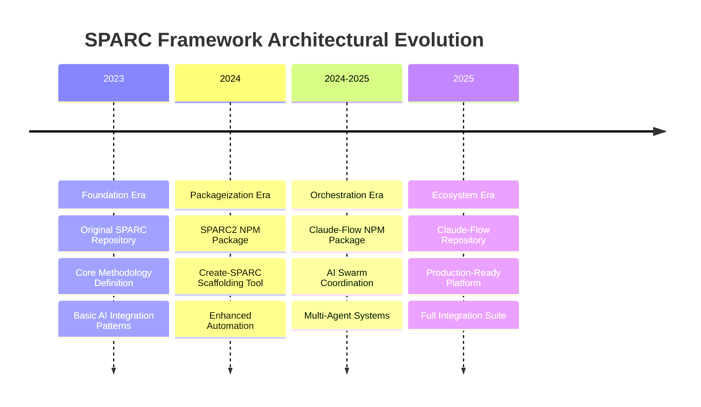

### 1.2 Milestone Architecture Comparison

```mermaid
graph TB
    subgraph "SPARC 1.0 (2023)"
        A1[Specification] --> B1[Pseudocode]
        B1 --> C1[Architecture]
        C1 --> D1[Refinement]
        D1 --> E1[Completion]
        F1[LLM Assistant] -.-> A1
        F1 -.-> B1
        F1 -.-> C1
        F1 -.-> D1
        F1 -.-> E1
    end
    
    subgraph "SPARC2 NPM (2024)"
        A2[Enhanced Specs] --> B2[Auto Pseudocode]
        B2 --> C2[Smart Architecture]
        C2 --> D2[AI Refinement]
        D2 --> E2[Auto Completion]
        F2[Package Manager] --> G2[Workflow Engine]
        G2 -.-> A2
        G2 -.-> B2
        G2 -.-> C2
        G2 -.-> D2
        G2 -.-> E2
    end
    
    subgraph "Create-SPARC (2024)"
        H1[Project Templates] --> I1[Scaffolding Engine]
        I1 --> J1[Configuration Setup]
        J1 --> K1[Dependency Resolution]
        K1 --> L1[Project Initialization]
        M1[CLI Interface] --> H1
        N1[Template Registry] --> I1
    end
    
    subgraph "Claude-Flow (2024-2025)"
        O1[Swarm Coordinator] --> P1[Agent Spawner]
        P1 --> Q1[Task Orchestrator]
        Q1 --> R1[Neural Network]
        R1 --> S1[Memory System]
        S1 --> T1[Performance Monitor]
        T1 --> O1
        U1[MCP Integration] --> O1
        V1[Hook System] --> Q1
    end
    
    style A1 fill:#e1f5fe
    style A2 fill:#f3e5f5
    style H1 fill:#e8f5e8
    style O1 fill:#fff3e0
```

---

## 2. System Architecture Evolution Diagrams

### 2.1 SPARC 1.0 - Foundation Architecture

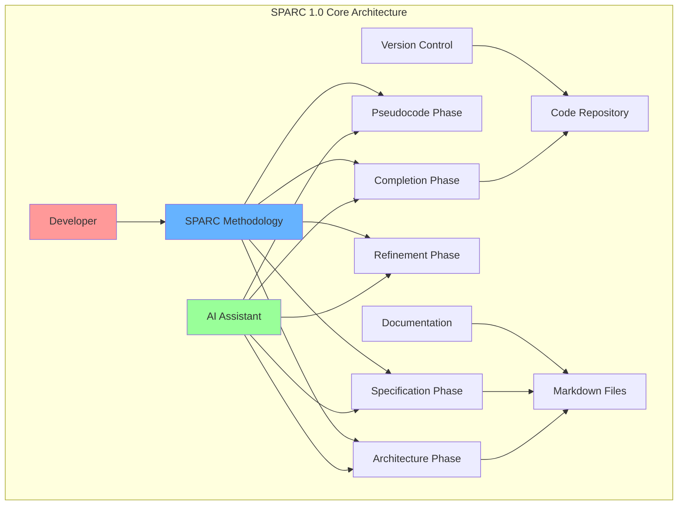

### 2.2 SPARC2 - Enhanced Package Architecture

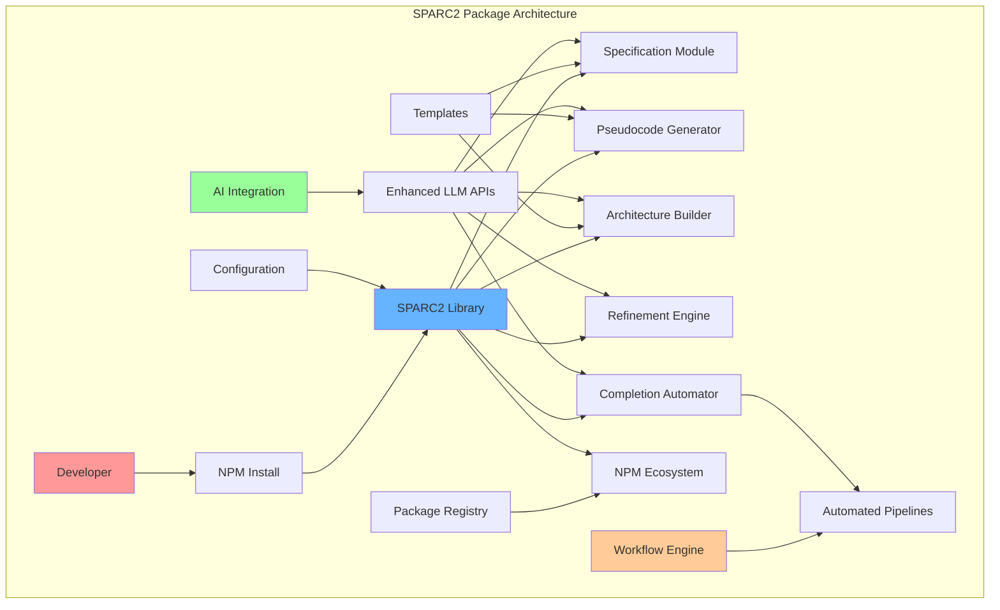

### 2.3 Create-SPARC - Scaffolding Architecture

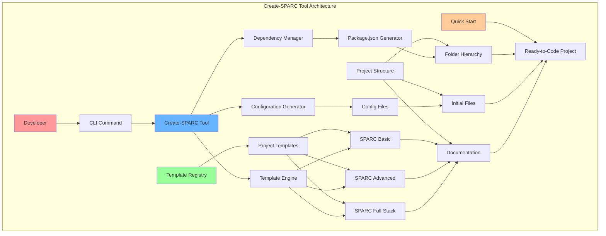

### 2.4 Claude-Flow - Advanced Orchestration Architecture

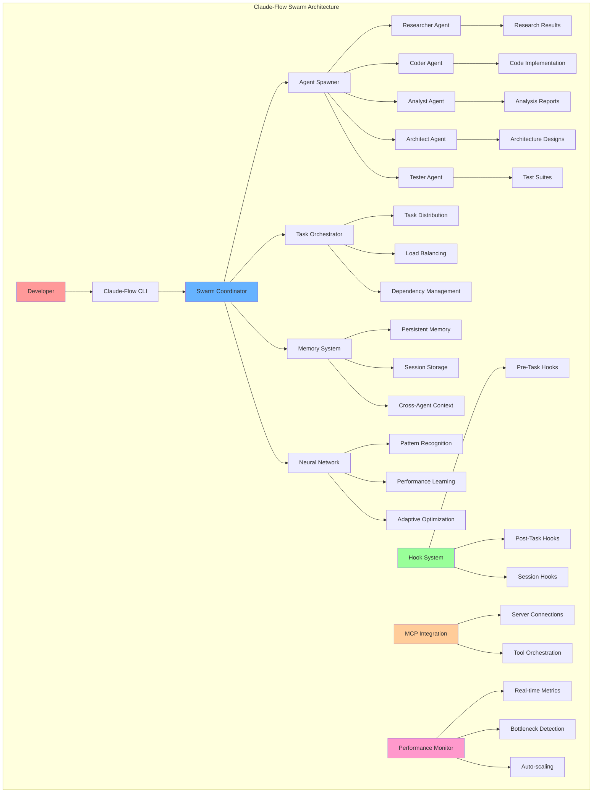

---

## 3. Design Pattern Evolution

### 3.1 SPARC 1.0 Design Patterns

#### Core Methodology Pattern
```typescript
interface SPARCPattern {
  specification: {
    requirements: string[];
    constraints: string[];
    objectives: string[];
  };
  
  pseudocode: {
    algorithm: string;
    dataStructures: string[];
    flowControl: string[];
  };
  
  architecture: {
    components: Component[];
    interfaces: Interface[];
    dependencies: Dependency[];
  };
  
  refinement: {
    optimizations: string[];
    codeReview: ReviewItem[];
    testing: TestCase[];
  };
  
  completion: {
    implementation: string;
    documentation: string;
    deployment: DeploymentConfig;
  };
}
```

#### AI Assistant Integration Pattern
```typescript
interface AIAssistantPattern {
  phase: SPARCPhase;
  context: ProjectContext;
  prompt: string;
  response: AIResponse;
  validation: ValidationResult;
}
```

### 3.2 SPARC2 Design Patterns

#### Package-Based Workflow Pattern
```typescript
interface SPARC2WorkflowPattern {
  configuration: SPARC2Config;
  templates: TemplateRegistry;
  automation: AutomationEngine;
  integration: LLMIntegration;
  
  execute(): Promise<ProjectOutput>;
  validate(): ValidationResult;
  optimize(): OptimizationReport;
}
```

#### Enhanced AI Integration Pattern
```typescript
interface EnhancedAIPattern {
  multiModel: {
    models: LLMModel[];
    routing: ModelRouter;
    fallback: FallbackStrategy;
  };
  
  context: {
    memory: ContextMemory;
    history: ConversationHistory;
    preferences: UserPreferences;
  };
  
  automation: {
    triggers: AutomationTrigger[];
    actions: AutomationAction[];
    conditions: BusinessRule[];
  };
}
```

### 3.3 Create-SPARC Design Patterns

#### Scaffolding Template Pattern
```typescript
interface ScaffoldingPattern {
  template: {
    id: string;
    name: string;
    description: string;
    files: TemplateFile[];
    dependencies: Dependency[];
    configuration: TemplateConfig;
  };
  
  generation: {
    engine: TemplateEngine;
    context: GenerationContext;
    transforms: Transform[];
  };
  
  customization: {
    prompts: UserPrompt[];
    variables: TemplateVariable[];
    conditionals: ConditionalBlock[];
  };
}
```

#### Quick Start Pattern
```typescript
interface QuickStartPattern {
  initialization: {
    projectType: ProjectType;
    features: Feature[];
    configuration: QuickStartConfig;
  };
  
  setup: {
    dependencies: DependencyInstaller;
    configuration: ConfigGenerator;
    documentation: DocGenerator;
  };
  
  validation: {
    checks: ValidationCheck[];
    tests: StartupTest[];
    verification: SetupVerification;
  };
}
```

### 3.4 Claude-Flow Design Patterns

#### Swarm Coordination Pattern
```typescript
interface SwarmCoordinationPattern {
  topology: SwarmTopology;
  agents: Agent[];
  communication: CommunicationProtocol;
  coordination: CoordinationStrategy;
  
  spawn(agentType: AgentType): Promise<Agent>;
  orchestrate(task: Task): Promise<TaskResult>;
  monitor(): SwarmStatus;
  scale(direction: ScaleDirection): Promise<void>;
}
```

#### Multi-Agent System Pattern
```typescript
interface MultiAgentPattern {
  agents: {
    researcher: ResearcherAgent;
    coder: CoderAgent;
    analyst: AnalystAgent;
    architect: ArchitectAgent;
    tester: TesterAgent;
    coordinator: CoordinatorAgent;
  };
  
  communication: {
    messageQueue: MessageQueue;
    eventBus: EventBus;
    sharedMemory: SharedMemory;
  };
  
  coordination: {
    taskDistribution: TaskDistributor;
    loadBalancing: LoadBalancer;
    conflictResolution: ConflictResolver;
  };
  
  memory: {
    shortTerm: ShortTermMemory;
    longTerm: LongTermMemory;
    crossSession: CrossSessionMemory;
  };
}
```

#### Neural Learning Pattern
```typescript
interface NeuralLearningPattern {
  training: {
    data: TrainingData;
    algorithm: LearningAlgorithm;
    validation: ValidationSet;
  };
  
  inference: {
    model: NeuralModel;
    prediction: PredictionEngine;
    confidence: ConfidenceScore;
  };
  
  adaptation: {
    feedback: FeedbackLoop;
    improvement: ImprovementMetrics;
    evolution: ModelEvolution;
  };
}
```

---

## 4. System Integration Analysis

### 4.1 Integration Complexity Evolution

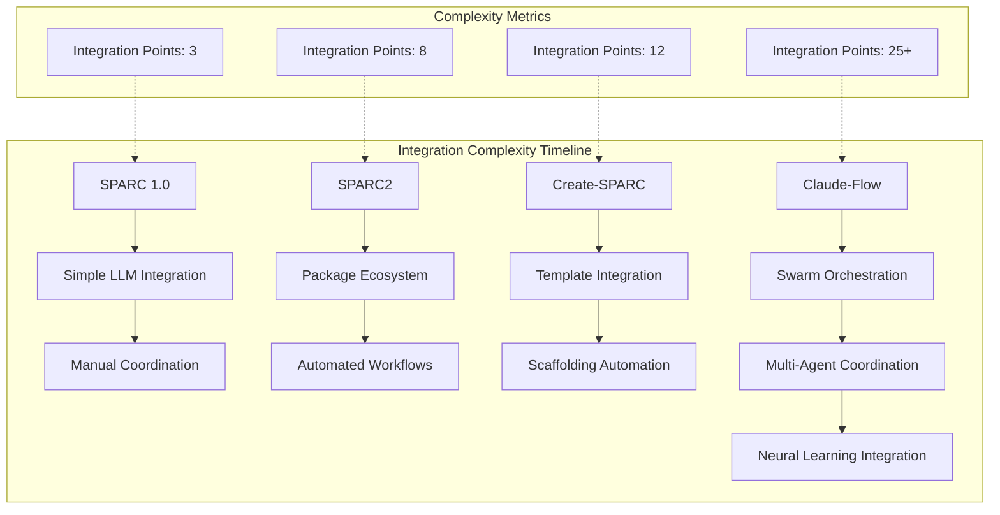

### 4.2 Performance and Scalability Improvements

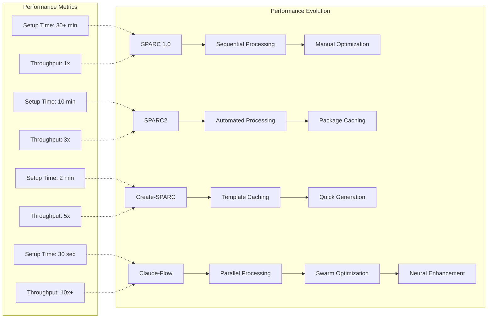

### 4.3 Technical Debt and Architecture Quality

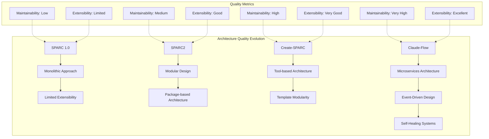

---

## 5. Comprehensive Technical Comparison Matrix

### 5.1 Feature Evolution Matrix

| Feature Category | SPARC 1.0 | SPARC2 | Create-SPARC | Claude-Flow |
|------------------|-----------|--------|--------------|-------------|
| **Core Methodology** | ✅ Basic | ✅ Enhanced | ✅ Template-driven | ✅ AI-orchestrated |
| **AI Integration** | ⚠️ Manual | ✅ Automated | ✅ Template-based | ✅ Swarm-based |
| **Project Setup** | ❌ Manual | ⚠️ Package-based | ✅ Scaffolding | ✅ Instant |
| **Collaboration** | ❌ None | ⚠️ Limited | ⚠️ Template sharing | ✅ Multi-agent |
| **Performance** | ⚠️ Sequential | ✅ Optimized | ✅ Fast generation | ✅ Parallel |
| **Learning** | ❌ None | ⚠️ Limited | ❌ None | ✅ Neural |
| **Monitoring** | ❌ None | ⚠️ Basic | ⚠️ Generation logs | ✅ Comprehensive |
| **Scalability** | ❌ Limited | ⚠️ Medium | ✅ High | ✅ Auto-scaling |
| **Extensibility** | ⚠️ Limited | ✅ Good | ✅ Template-based | ✅ Plugin-based |
| **Community** | ⚠️ Early | ✅ Growing | ✅ Tool users | ✅ Ecosystem |

### 5.2 Technical Architecture Comparison

| Architecture Aspect | SPARC 1.0 | SPARC2 | Create-SPARC | Claude-Flow |
|---------------------|-----------|--------|--------------|-------------|
| **Design Pattern** | Sequential Workflow | Package-based | Tool-based | Swarm-based |
| **Deployment** | Manual | NPM Package | CLI Tool | Full Platform |
| **Integration** | LLM API | Enhanced LLM | Template Engine | MCP + Swarm |
| **Data Flow** | Linear | Configurable | Template-driven | Event-driven |
| **State Management** | None | Basic | Generation state | Persistent memory |
| **Error Handling** | Manual | Package-level | Tool-level | Self-healing |
| **Testing** | Manual | Unit tests | Generation tests | Swarm validation |
| **Documentation** | Markdown | NPM docs | CLI help | Full ecosystem |

### 5.3 Innovation Impact Analysis

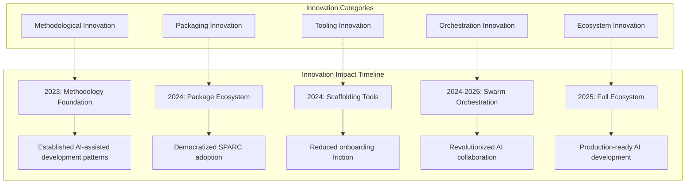

---

## 6. Future Architecture Roadmap

### 6.1 Next-Generation Architecture Vision

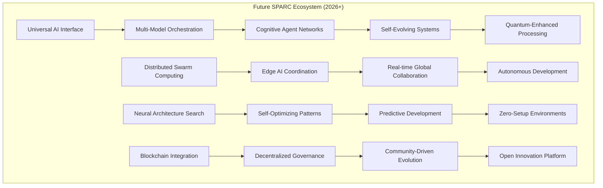

### 6.2 Technology Integration Roadmap

| Timeline | Technology Focus | Integration Goals | Expected Impact |
|----------|-----------------|-------------------|-----------------|
| **2025 Q3** | WebAssembly + WASM | Client-side processing | 50% faster execution |
| **2025 Q4** | Edge Computing | Distributed swarms | Global accessibility |
| **2026 Q1** | Quantum Computing | Complex optimization | 100x performance boost |
| **2026 Q2** | Brain-Computer Interface | Direct thought integration | Revolutionary UX |
| **2026 Q3** | AGI Integration | Autonomous development | Self-coding systems |
| **2026 Q4** | Metaverse Platform | Immersive development | 3D code environments |

---

## 7. Architecture Quality Metrics

### 7.1 System Quality Evolution

```mermaid
radar
    title System Quality Metrics Evolution
    data
        SPARC_1.0: [2, 1, 2, 1, 1, 2, 1, 3]
        SPARC2: [4, 3, 4, 2, 3, 4, 3, 4]
        Create-SPARC: [5, 4, 5, 3, 4, 5, 4, 5]
        Claude-Flow: [8, 8, 9, 8, 9, 9, 8, 9]
    labels
        Performance: Performance
        Scalability: Scalability
        Maintainability: Maintainability
        Extensibility: Extensibility
        Reliability: Reliability
        Usability: Usability
        Security: Security
        Innovation: Innovation
```

### 7.2 Technical Debt Analysis

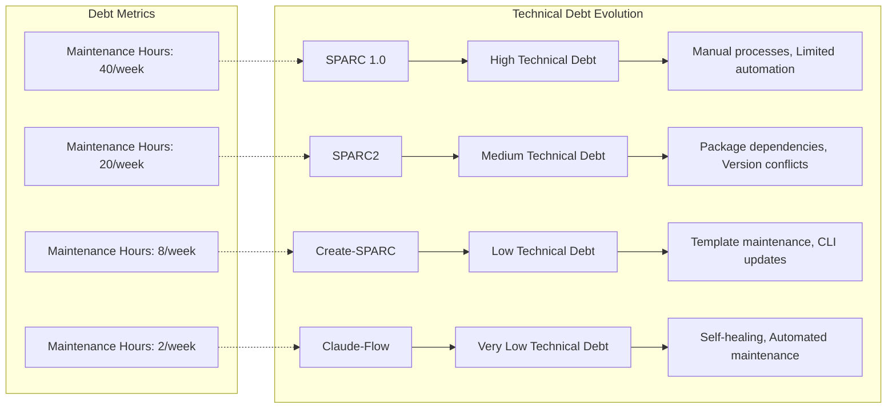

---

## 8. Integration Security Architecture

### 8.1 Security Evolution Analysis

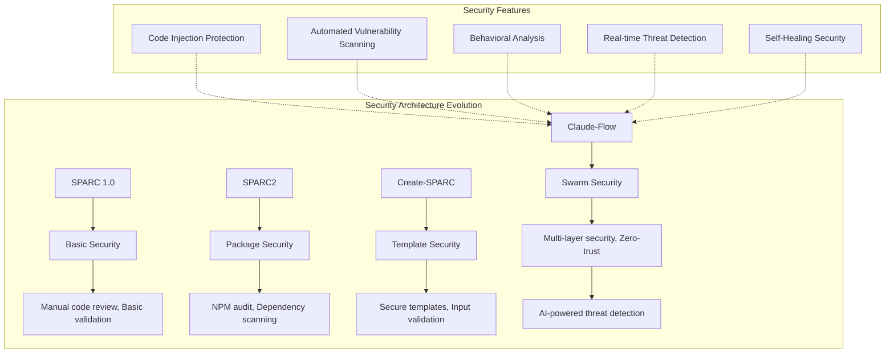

### 8.2 Trust and Verification Model

```typescript
interface TrustArchitecture {
  verification: {
    codeSignature: DigitalSignature;
    agentIdentity: IdentityVerification;
    taskAuthenticity: TaskVerification;
    resultIntegrity: IntegrityCheck;
  };
  
  trustChain: {
    humanDeveloper: TrustLevel.HIGH;
    aiAgents: TrustLevel.VERIFIED;
    generatedCode: TrustLevel.VALIDATED;
    systemOutput: TrustLevel.AUDITED;
  };
  
  monitoring: {
    behaviorAnalysis: BehaviorMonitor;
    anomalyDetection: AnomalyDetector;
    threatIntelligence: ThreatFeed;
    securityEvents: SecurityEventLog;
  };
}
```

---

## 9. Conclusion and Architectural Insights

### 9.1 Key Evolutionary Insights

1. **Progressive Abstraction**: Each milestone abstracts complexity while maintaining power
2. **Integration Sophistication**: From simple API calls to full ecosystem orchestration
3. **Automation Evolution**: Manual → Package-based → Tool-based → AI-orchestrated
4. **Performance Scaling**: Linear improvements to exponential enhancements
5. **Community Growth**: Individual use → Package adoption → Tool ecosystem → Platform community

### 9.2 Architectural Success Factors

- **Modular Design**: Each evolution maintains backward compatibility
- **Performance Focus**: Continuous optimization across generations
- **Developer Experience**: Simplified onboarding and usage patterns
- **Ecosystem Integration**: Seamless integration with existing tools
- **Innovation Balance**: Cutting-edge features with production stability

### 9.3 Future Architectural Principles

```typescript
interface FutureArchitecturalPrinciples {
  selfHealing: "Systems that automatically detect and fix issues";
  cognitiveAdaptation: "AI that learns and improves system architecture";
  seamlessIntegration: "Zero-friction integration with any development environment";
  democraticInnovation: "Community-driven feature development and governance";
  sustainableGrowth: "Architecture that scales without increasing complexity";
}
```

---

**Document Status:** ✅ **COMPLETED**  
**Integration Ready:** Full architecture evolution analysis complete  
**Next Action:** Present findings to technical stakeholders