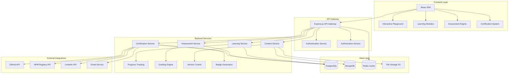

# SPARC Evolution Platform - Technical Architecture

**Document Version:** 1.0  
**Date:** July 12, 2025  
**Architect:** Claude AI (Architect Worker)  
**Project:** SPARC Evolution Analysis & Educational Platform

---

## 1. Architecture Overview

The SPARC Evolution Platform is designed as a modern, scalable learning management system that chronicles the evolution of Reuven Cohen's SPARC methodology through interactive education. The platform combines historical analysis with hands-on learning experiences.

### 1.1 High-Level Architecture



### 1.2 Core Principles

1. **Microservices Architecture**: Modular, independently deployable services
2. **Event-Driven Communication**: Asynchronous messaging between services
3. **Progressive Enhancement**: Works offline, enhanced when online
4. **Mobile-First Design**: Responsive across all devices
5. **Security by Design**: Zero-trust architecture with encryption
6. **Scalability**: Horizontal scaling capabilities
7. **Observability**: Comprehensive monitoring and logging

---

## 2. Frontend Architecture

### 2.1 Technology Stack

- **Framework**: React 18 with TypeScript
- **State Management**: Redux Toolkit + RTK Query
- **Routing**: React Router v6
- **UI Framework**: Material-UI v5 with custom theme
- **Code Editor**: Monaco Editor (VS Code engine)
- **Styling**: Emotion CSS-in-JS
- **Testing**: Jest + React Testing Library + Cypress

### 2.2 Component Architecture

```
src/
├── components/
│   ├── common/           # Reusable UI components
│   ├── learning/         # Learning module components
│   ├── playground/       # Code playground components
│   ├── assessment/       # Assessment components
│   └── certification/    # Certification components
├── pages/
│   ├── Home/
│   ├── Learning/
│   ├── Playground/
│   ├── Assessment/
│   └── Profile/
├── services/
│   ├── api/              # API client configurations
│   ├── auth/             # Authentication service
│   └── storage/          # Local storage management
├── hooks/                # Custom React hooks
├── utils/                # Utility functions
└── types/                # TypeScript type definitions
```

### 2.3 Interactive Code Playground

The playground is the centerpiece of the learning experience:

```typescript
interface PlaygroundEnvironment {
  language: 'javascript' | 'python' | 'typescript' | 'go';
  sparcVersion: 'v1' | 'v2' | 'create-sparc' | 'claude-flow';
  template: string;
  dependencies: string[];
  executionEnvironment: 'browser' | 'docker' | 'serverless';
}

interface PlaygroundFeatures {
  realTimeExecution: boolean;
  syntaxHighlighting: boolean;
  autoComplete: boolean;
  errorHighlighting: boolean;
  debuggingTools: boolean;
  versionControl: boolean;
  shareableLinks: boolean;
  collaborativeEditing: boolean;
}
```

### 2.4 Learning Module Interface

```typescript
interface LearningModule {
  id: string;
  title: string;
  description: string;
  level: 'beginner' | 'intermediate' | 'advanced' | 'expert';
  estimatedTime: number; // minutes
  prerequisites: string[];
  objectives: string[];
  sections: LearningSection[];
  assessment: Assessment;
  certification?: CertificationLevel;
}

interface LearningSection {
  id: string;
  title: string;
  type: 'theory' | 'practical' | 'video' | 'quiz' | 'playground';
  content: string;
  interactiveElements: InteractiveElement[];
  nextAction: NavigationAction;
}
```

---

## 3. Backend Architecture

### 3.1 Microservices Design

#### 3.1.1 API Gateway Service
- **Technology**: Express.js + TypeScript
- **Responsibilities**:
  - Request routing and load balancing
  - Authentication and authorization
  - Rate limiting and throttling
  - Request/response transformation
  - API versioning

#### 3.1.2 Learning Management Service
- **Technology**: Node.js + TypeScript + PostgreSQL
- **Responsibilities**:
  - Course content management
  - Progress tracking
  - Adaptive learning paths
  - Personalization engine

#### 3.1.3 Assessment Engine Service
- **Technology**: Node.js + TypeScript + PostgreSQL
- **Responsibilities**:
  - Quiz and test generation
  - Automated code evaluation
  - Peer review system
  - Plagiarism detection

#### 3.1.4 Code Execution Service
- **Technology**: Docker + Kubernetes + Sandboxed environments
- **Responsibilities**:
  - Safe code execution
  - Multi-language support
  - Resource limitation
  - Output capture and analysis

#### 3.1.5 Certification Service
- **Technology**: Node.js + TypeScript + Blockchain (optional)
- **Responsibilities**:
  - Certificate generation
  - Verification system
  - Badge management
  - LinkedIn integration

### 3.2 Data Architecture

#### 3.2.1 PostgreSQL (Primary Database)
```sql
-- Core entity relationships
TABLE users (
  id UUID PRIMARY KEY,
  email VARCHAR UNIQUE NOT NULL,
  profile JSONB,
  created_at TIMESTAMP,
  updated_at TIMESTAMP
);

TABLE learning_modules (
  id UUID PRIMARY KEY,
  title VARCHAR NOT NULL,
  content JSONB,
  version INTEGER,
  status VARCHAR,
  created_at TIMESTAMP
);

TABLE user_progress (
  id UUID PRIMARY KEY,
  user_id UUID REFERENCES users(id),
  module_id UUID REFERENCES learning_modules(id),
  progress_data JSONB,
  completed_at TIMESTAMP,
  score INTEGER
);

TABLE assessments (
  id UUID PRIMARY KEY,
  module_id UUID REFERENCES learning_modules(id),
  type VARCHAR NOT NULL,
  questions JSONB,
  grading_criteria JSONB
);

TABLE certificates (
  id UUID PRIMARY KEY,
  user_id UUID REFERENCES users(id),
  level VARCHAR NOT NULL,
  issued_at TIMESTAMP,
  verification_hash VARCHAR UNIQUE,
  blockchain_tx VARCHAR
);
```

#### 3.2.2 MongoDB (Content Management)
```javascript
// Flexible content storage
{
  _id: ObjectId,
  type: "sparc_evolution_content",
  version: "v1|v2|create-sparc|claude-flow",
  metadata: {
    repository: String,
    commit_hash: String,
    analysis_date: Date,
    contributor: String
  },
  content: {
    code_examples: [CodeExample],
    documentation: String,
    architectural_diagrams: [Diagram],
    evolution_notes: String
  },
  searchable_content: String, // For full-text search
  tags: [String],
  last_updated: Date
}
```

#### 3.2.3 Redis (Caching & Session Management)
```javascript
// Session management
SET user:session:{sessionId} {
  userId: String,
  permissions: [String],
  currentModule: String,
  progress: Object,
  expiresAt: Number
}

// Code execution cache
SET code:execution:{hash} {
  language: String,
  code: String,
  output: String,
  executionTime: Number,
  cached_at: Number,
  ttl: 3600 // 1 hour
}

// Learning analytics cache
SET analytics:user:{userId} {
  totalTimeSpent: Number,
  modulesCompleted: Number,
  averageScore: Number,
  currentStreak: Number,
  lastActivity: Date
}
```

---

## 4. Security Architecture

### 4.1 Authentication & Authorization

```typescript
interface AuthenticationFlow {
  methods: ['OAuth2', 'SAML', 'Email+Password', 'Social'];
  providers: ['Google', 'GitHub', 'LinkedIn', 'Microsoft'];
  tokenStrategy: 'JWT';
  refreshTokenRotation: boolean;
  mfaSupport: boolean;
}

interface AuthorizationModel {
  type: 'RBAC'; // Role-Based Access Control
  roles: ['student', 'instructor', 'admin', 'content_creator'];
  permissions: Permission[];
  resourceAccess: ResourcePermission[];
}
```

### 4.2 Data Protection

1. **Encryption at Rest**: AES-256 encryption for sensitive data
2. **Encryption in Transit**: TLS 1.3 for all communications
3. **PII Protection**: Anonymization and pseudonymization
4. **GDPR Compliance**: Right to deletion and data portability
5. **Audit Logging**: Comprehensive activity tracking

### 4.3 Code Execution Security

```typescript
interface CodeExecutionSecurity {
  sandboxing: {
    technology: 'Docker + gVisor';
    networkIsolation: boolean;
    resourceLimits: {
      memory: '512MB';
      cpu: '0.5 cores';
      executionTime: '30 seconds';
      diskSpace: '100MB';
    };
  };
  
  codeAnalysis: {
    staticAnalysis: boolean;
    malwareScanning: boolean;
    dependencyScanning: boolean;
    secretDetection: boolean;
  };
  
  monitoring: {
    realTimeMonitoring: boolean;
    anomalyDetection: boolean;
    alerting: boolean;
  };
}
```

---

## 5. Assessment System Architecture

### 5.1 Assessment Types

```typescript
interface AssessmentSystem {
  types: {
    multipleChoice: MultipleChoiceAssessment;
    codeCompletion: CodeCompletionAssessment;
    projectBased: ProjectAssessment;
    peerReview: PeerReviewAssessment;
    practical: PracticalAssessment;
  };
  
  gradingMethods: {
    automated: AutomatedGrading;
    rubricBased: RubricGrading;
    peerGrading: PeerGrading;
    instructorGrading: InstructorGrading;
  };
}
```

### 5.2 Automated Code Evaluation

```typescript
interface CodeEvaluationEngine {
  testingFrameworks: ['Jest', 'PyTest', 'GoTest'];
  evaluationCriteria: {
    functionalCorrectness: boolean;
    codeQuality: boolean;
    performance: boolean;
    bestPractices: boolean;
    documentation: boolean;
  };
  
  feedbackGeneration: {
    realTimeFeedback: boolean;
    suggestionEngine: boolean;
    codeRecommendations: boolean;
    learningPathAdaptation: boolean;
  };
}
```

### 5.3 Adaptive Assessment

The system adapts to learner performance:

```typescript
interface AdaptiveAssessment {
  difficultyAdjustment: {
    algorithm: 'IRT'; // Item Response Theory
    parameters: {
      ability: number;
      difficulty: number;
      discrimination: number;
      guessing: number;
    };
  };
  
  personalization: {
    learningStyle: 'visual' | 'auditory' | 'kinesthetic' | 'reading';
    pace: 'self-paced' | 'structured' | 'intensive';
    preferences: UserPreferences;
  };
}
```

---

## 6. Certification System Architecture

### 6.1 Certification Levels

```typescript
interface CertificationLevels {
  practitioner: {
    requirements: ['Complete Module 1', 'Pass foundation assessment'];
    skills: ['Basic SPARC understanding', 'Simple implementations'];
    validityPeriod: '2 years';
  };
  
  developer: {
    requirements: ['Complete Modules 1-3', 'Build practical project'];
    skills: ['Intermediate SPARC', 'Production implementations'];
    validityPeriod: '2 years';
  };
  
  architect: {
    requirements: ['Complete Modules 1-4', 'Design system architecture'];
    skills: ['Advanced patterns', 'System design', 'Performance optimization'];
    validityPeriod: '3 years';
  };
  
  master: {
    requirements: ['Complete all modules', 'Contribute to SPARC evolution'];
    skills: ['Expert level', 'Innovation', 'Community leadership'];
    validityPeriod: '5 years';
  };
}
```

### 6.2 Verification System

```typescript
interface CertificationVerification {
  blockchain: {
    network: 'Ethereum' | 'Polygon';
    smartContract: string;
    verificationHash: string;
  };
  
  traditional: {
    digitalSignature: string;
    certificateId: string;
    qrCode: string;
    verificationUrl: string;
  };
  
  integrations: {
    linkedin: boolean;
    github: boolean;
    credly: boolean;
    badgr: boolean;
  };
}
```

---

## 7. Performance Architecture

### 7.1 Scalability Design

```typescript
interface ScalabilityArchitecture {
  horizontalScaling: {
    containerization: 'Docker + Kubernetes';
    loadBalancing: 'NGINX + HAProxy';
    autoScaling: {
      cpu: '70%';
      memory: '80%';
      requestRate: '1000 req/min';
    };
  };
  
  caching: {
    levels: ['Browser', 'CDN', 'Application', 'Database'];
    strategies: ['LRU', 'TTL', 'Write-through', 'Write-behind'];
    technologies: ['Redis', 'Memcached', 'CloudFlare'];
  };
  
  databaseOptimization: {
    readReplicas: number;
    sharding: boolean;
    indexing: string[];
    queryOptimization: boolean;
  };
}
```

### 7.2 Performance Monitoring

```typescript
interface PerformanceMonitoring {
  metrics: {
    responseTime: 'p50, p95, p99';
    throughput: 'requests per second';
    errorRate: 'percentage';
    availability: 'uptime percentage';
  };
  
  tools: {
    apm: 'New Relic | DataDog';
    logging: 'ELK Stack';
    tracing: 'Jaeger';
    metrics: 'Prometheus + Grafana';
  };
  
  alerts: {
    sla: 'Response time > 2s';
    error: 'Error rate > 1%';
    availability: 'Uptime < 99.5%';
  };
}
```

---

## 8. DevOps & Deployment Architecture

### 8.1 CI/CD Pipeline

```yaml
# .github/workflows/deploy.yml
name: Deploy SPARC Evolution Platform

on:
  push:
    branches: [main, staging]

jobs:
  test:
    runs-on: ubuntu-latest
    steps:
      - uses: actions/checkout@v3
      - name: Run tests
        run: |
          npm test
          npm run test:e2e
          npm run security-scan
          
  build:
    needs: test
    runs-on: ubuntu-latest
    steps:
      - name: Build and push Docker images
        run: |
          docker build -t sparc-evolution:${{ github.sha }} .
          docker push sparc-evolution:${{ github.sha }}
          
  deploy:
    needs: build
    runs-on: ubuntu-latest
    steps:
      - name: Deploy to Kubernetes
        run: |
          kubectl set image deployment/sparc-evolution \
            sparc-evolution=sparc-evolution:${{ github.sha }}
```

### 8.2 Infrastructure as Code

```terraform
# infrastructure/main.tf
resource "aws_eks_cluster" "sparc_evolution" {
  name     = "sparc-evolution-cluster"
  role_arn = aws_iam_role.cluster.arn
  version  = "1.27"

  vpc_config {
    subnet_ids = aws_subnet.cluster[*].id
  }
}

resource "aws_rds_instance" "postgres" {
  identifier = "sparc-evolution-db"
  engine     = "postgres"
  engine_version = "15.3"
  instance_class = "db.r6g.large"
  
  allocated_storage     = 100
  max_allocated_storage = 1000
  storage_encrypted     = true
  
  db_name  = "sparc_evolution"
  username = "admin"
  password = var.db_password
  
  backup_retention_period = 7
  backup_window          = "03:00-04:00"
  maintenance_window     = "sun:04:00-sun:05:00"
  
  tags = {
    Environment = var.environment
    Project     = "sparc-evolution"
  }
}
```

---

## 9. Integration Architecture

### 9.1 External System Integrations

```typescript
interface ExternalIntegrations {
  github: {
    api: 'REST v4 + GraphQL v4';
    webhooks: boolean;
    oauth: boolean;
    purposes: ['Repository analysis', 'Code examples', 'Version tracking'];
  };
  
  npmRegistry: {
    api: 'NPM Registry API';
    purposes: ['Package analysis', 'Version tracking', 'Dependency mapping'];
  };
  
  linkedin: {
    api: 'LinkedIn Learning API';
    purposes: ['Certificate sharing', 'Professional profile updates'];
  };
  
  email: {
    service: 'SendGrid | AWS SES';
    purposes: ['Notifications', 'Certificate delivery', 'Marketing'];
  };
}
```

### 9.2 API Design

```typescript
// RESTful API structure
interface APIEndpoints {
  '/api/v1/modules': {
    GET: 'List all learning modules';
    POST: 'Create new module (admin)';
  };
  
  '/api/v1/modules/{id}': {
    GET: 'Get specific module details';
    PUT: 'Update module (admin)';
    DELETE: 'Delete module (admin)';
  };
  
  '/api/v1/users/{id}/progress': {
    GET: 'Get user learning progress';
    POST: 'Update progress';
  };
  
  '/api/v1/assessments/{id}/submit': {
    POST: 'Submit assessment for grading';
  };
  
  '/api/v1/playground/execute': {
    POST: 'Execute code in playground';
  };
  
  '/api/v1/certificates/generate': {
    POST: 'Generate certificate';
  };
}
```

---

## 10. Content Management Architecture

### 10.1 SPARC Evolution Content Structure

```typescript
interface SPARCEvolutionContent {
  versions: {
    'sparc-v1': {
      repository: 'https://github.com/ruvnet/sparc';
      keyFeatures: string[];
      codeExamples: CodeExample[];
      documentation: string;
      innovations: string[];
    };
    
    'sparc2': {
      package: '@agentics.org/sparc2';
      improvements: string[];
      migrationGuide: string;
      newFeatures: string[];
    };
    
    'create-sparc': {
      package: 'create-sparc';
      scaffolding: boolean;
      templates: Template[];
      quickStart: string;
    };
    
    'claude-flow': {
      repository: 'https://github.com/ruvnet/claude-flow';
      package: 'claude-flow';
      aiIntegration: boolean;
      features: string[];
    };
  };
}
```

### 10.2 Content Versioning

```typescript
interface ContentVersioning {
  strategy: 'Git-based versioning';
  structure: {
    content: 'Markdown + MDX';
    code: 'Executable examples';
    media: 'Images, videos, diagrams';
    metadata: 'Learning objectives, prerequisites';
  };
  
  workflow: {
    creation: 'Content creators write in MDX';
    review: 'Peer review process';
    approval: 'Technical review + QA';
    publishing: 'Automated deployment';
    updates: 'Version-controlled updates';
  };
}
```

---

## 11. Mobile Architecture

### 11.1 Progressive Web App (PWA)

```typescript
interface PWAFeatures {
  offlineSupport: {
    caching: 'Service Workers + Cache API';
    content: 'Essential learning materials';
    sync: 'Background sync when online';
  };
  
  nativeFeatures: {
    pushNotifications: boolean;
    installability: boolean;
    fullScreenMode: boolean;
    deviceOrientation: boolean;
  };
  
  responsiveDesign: {
    breakpoints: ['mobile', 'tablet', 'desktop', 'wide'];
    touchOptimization: boolean;
    gestureSupport: boolean;
  };
}
```

### 11.2 Mobile-First Design Principles

1. **Touch-Friendly Interface**: Minimum 44px touch targets
2. **Optimized Performance**: < 3s loading time on 3G
3. **Offline Learning**: Core content available offline
4. **Progressive Enhancement**: Works without JavaScript
5. **Adaptive Content**: Adjusts based on screen size and connection

---

## 12. Analytics Architecture

### 12.1 Learning Analytics

```typescript
interface LearningAnalytics {
  userMetrics: {
    engagementTime: number;
    completionRate: number;
    retentionRate: number;
    performanceScore: number;
  };
  
  contentMetrics: {
    popularityIndex: number;
    difficultyRating: number;
    effectivenessScore: number;
    dropOffPoints: number[];
  };
  
  systemMetrics: {
    usagePatterns: Pattern[];
    peakHours: TimeSlot[];
    geographicDistribution: GeoData[];
    deviceUsage: DeviceStats[];
  };
}
```

### 12.2 Data Privacy & Compliance

```typescript
interface DataPrivacy {
  compliance: ['GDPR', 'CCPA', 'FERPA', 'COPPA'];
  
  dataMinimization: {
    collection: 'Only necessary data';
    retention: 'Time-bound storage';
    purpose: 'Clear purpose definition';
  };
  
  userRights: {
    access: 'Data portability';
    rectification: 'Data correction';
    erasure: 'Right to be forgotten';
    portability: 'Data export';
  };
  
  consent: {
    granular: boolean;
    withdrawal: boolean;
    transparent: boolean;
  };
}
```

---

## 13. Disaster Recovery & Business Continuity

### 13.1 Backup Strategy

```typescript
interface BackupStrategy {
  databases: {
    frequency: 'Every 6 hours';
    retention: '30 days point-in-time recovery';
    crossRegion: boolean;
    encryption: 'AES-256';
  };
  
  files: {
    frequency: 'Daily incremental, weekly full';
    retention: '1 year';
    versioning: boolean;
    geographicDistribution: ['US-East', 'EU-West'];
  };
  
  configuration: {
    infrastructure: 'Terraform state backup';
    application: 'Configuration as code';
    secrets: 'Encrypted key backup';
  };
}
```

### 13.2 Recovery Procedures

```typescript
interface DisasterRecovery {
  rto: '4 hours'; // Recovery Time Objective
  rpo: '1 hour';  // Recovery Point Objective
  
  procedures: {
    databaseFailure: 'Automated failover to read replica';
    applicationFailure: 'Blue-green deployment rollback';
    regionFailure: 'Cross-region disaster recovery';
    dataCorruption: 'Point-in-time recovery';
  };
  
  testing: {
    frequency: 'Monthly';
    scenarios: ['Partial failure', 'Complete outage', 'Data corruption'];
    documentation: 'Runbook maintenance';
  };
}
```

---

## 14. Future Architecture Considerations

### 14.1 Emerging Technologies

```typescript
interface FutureTechnologies {
  ai: {
    personalizedLearning: 'AI-driven adaptive pathways';
    intelligentTutoring: 'Virtual teaching assistants';
    contentGeneration: 'Dynamic exercise creation';
  };
  
  immersive: {
    vr: 'Virtual reality coding environments';
    ar: 'Augmented reality debugging';
    mixedReality: 'Collaborative virtual spaces';
  };
  
  blockchain: {
    credentialVerification: 'Immutable certificates';
    micropayments: 'Content creator rewards';
    decentralizedContent: 'Community-driven courses';
  };
}
```

### 14.2 Scalability Roadmap

```typescript
interface ScalabilityRoadmap {
  phase1: {
    users: '< 10k';
    architecture: 'Monolithic with microservice preparation';
    database: 'Single PostgreSQL instance';
  };
  
  phase2: {
    users: '10k - 100k';
    architecture: 'Microservices transition';
    database: 'Read replicas + caching';
  };
  
  phase3: {
    users: '100k - 1M';
    architecture: 'Full microservices + API mesh';
    database: 'Sharded database + multiple caches';
  };
  
  phase4: {
    users: '> 1M';
    architecture: 'Multi-region + edge computing';
    database: 'Distributed database + global cache';
  };
}
```

---

## 15. Technical Decisions & Rationale

### 15.1 Technology Choices

| Component | Technology | Rationale |
|-----------|------------|-----------|
| Frontend | React + TypeScript | Large ecosystem, strong typing, excellent tooling |
| Backend | Node.js + Express | JavaScript familiarity, rapid development, extensive libraries |
| Database | PostgreSQL + MongoDB | ACID compliance + flexible document storage |
| Cache | Redis | High performance, versatile data structures |
| Container | Docker + Kubernetes | Industry standard, scalability, orchestration |
| CI/CD | GitHub Actions | Integrated with repository, extensive marketplace |
| Monitoring | Prometheus + Grafana | Open source, powerful querying, beautiful dashboards |

### 15.2 Architectural Patterns

1. **Domain-Driven Design (DDD)**: Clear business domain separation
2. **CQRS (Command Query Responsibility Segregation)**: Optimized read/write operations
3. **Event Sourcing**: Audit trail and temporal queries
4. **Strangler Fig Pattern**: Gradual migration from monolith to microservices
5. **Circuit Breaker Pattern**: Fault tolerance and graceful degradation

---

## 16. Security Considerations

### 16.1 Threat Modeling

```typescript
interface ThreatModel {
  threats: {
    codeInjection: 'Malicious code execution in playground';
    dataBreaches: 'Unauthorized access to user data';
    ddos: 'Distributed denial of service attacks';
    socialEngineering: 'Phishing and account takeover';
    insecureApi: 'API vulnerabilities and data exposure';
  };
  
  mitigations: {
    codeInjection: 'Sandboxed execution + static analysis';
    dataBreaches: 'Encryption + access controls + monitoring';
    ddos: 'Rate limiting + CDN + auto-scaling';
    socialEngineering: 'MFA + security awareness training';
    insecureApi: 'Authentication + authorization + input validation';
  };
}
```

### 16.2 Security Controls

```typescript
interface SecurityControls {
  preventive: [
    'Input validation',
    'Authentication',
    'Authorization',
    'Encryption',
    'Network segmentation'
  ];
  
  detective: [
    'Logging and monitoring',
    'Intrusion detection',
    'Vulnerability scanning',
    'Security information and event management (SIEM)'
  ];
  
  corrective: [
    'Incident response',
    'Patch management',
    'Backup and recovery',
    'Forensic analysis'
  ];
}
```

---

## 17. Performance Requirements

### 17.1 Service Level Agreements (SLAs)

```typescript
interface SLARequirements {
  availability: {
    target: '99.9%';
    measurement: 'Monthly uptime';
    exclusions: ['Planned maintenance', 'Force majeure'];
  };
  
  performance: {
    pageLoadTime: '< 2 seconds';
    apiResponseTime: '< 500ms';
    codeExecutionTime: '< 30 seconds';
    searchResponseTime: '< 1 second';
  };
  
  scalability: {
    concurrentUsers: '10,000';
    peakLoad: '100,000 requests/hour';
    dataGrowth: '1TB/month';
  };
}
```

### 17.2 Performance Testing Strategy

```typescript
interface PerformanceTestingStrategy {
  loadTesting: {
    tool: 'Apache JMeter';
    scenarios: ['Normal load', 'Peak load', 'Stress load'];
    frequency: 'Weekly';
  };
  
  stressTesting: {
    tool: 'Artillery.js';
    scenarios: ['CPU stress', 'Memory stress', 'Network stress'];
    frequency: 'Monthly';
  };
  
  enduranceTesting: {
    duration: '24 hours';
    monitoring: 'Memory leaks, performance degradation';
    frequency: 'Quarterly';
  };
}
```

---

## Conclusion

This technical architecture provides a comprehensive foundation for the SPARC Evolution Platform, ensuring scalability, security, performance, and maintainability. The modular design allows for iterative development and future enhancements while maintaining system integrity.

The architecture supports the core educational mission by providing:
- **Interactive Learning**: Through the code playground and hands-on exercises
- **Progressive Education**: Via structured learning modules and adaptive assessments
- **Community Building**: Through collaboration features and certification systems
- **Innovation Tracking**: By documenting and analyzing SPARC methodology evolution

Regular architecture reviews and updates will ensure the platform continues to meet evolving user needs and technological advances.

---

**Next Steps:**
1. Review and approval by technical stakeholders
2. Implementation planning and sprint organization
3. Infrastructure setup and environment preparation
4. Development team onboarding and training
5. Security review and penetration testing planning

**Document Status:** ✅ **COMPLETED**  
**Review Required:** Architecture team and technical leads  
**Implementation Ready:** Upon stakeholder approval