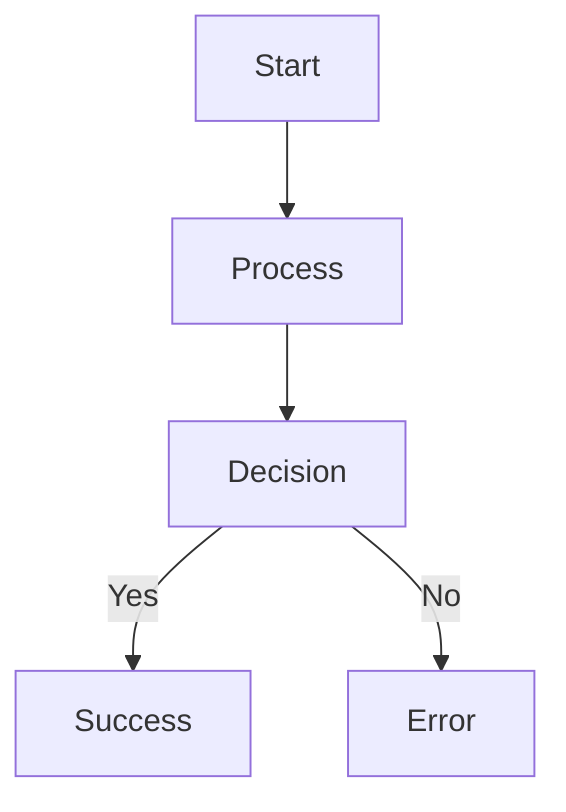

# SPARC Tutorial Content Template
## Standardized Format for Educational Materials

### Template Overview
**Purpose:** Ensure consistent, high-quality tutorial content across all SPARC educational materials
**Audience:** Content creators, instructors, and technical writers
**Usage:** Copy this template and customize for specific tutorial topics

---

## Tutorial Header Section

### Metadata Block
```yaml
---
title: "[Tutorial Title]"
category: "[Foundation|Intermediate|Advanced|Expert]"
duration: "[X minutes/hours]"
prerequisites: 
  - "Prerequisite 1"
  - "Prerequisite 2"
learning_objectives:
  - "Objective 1"
  - "Objective 2"
  - "Objective 3"
tools_required:
  - "Tool 1"
  - "Tool 2"
difficulty_level: "[Beginner|Intermediate|Advanced]"
last_updated: "YYYY-MM-DD"
author: "[Author Name]"
reviewer: "[Reviewer Name]"
---
```

### Title & Introduction
```markdown
# [Tutorial Title]
## [Descriptive Subtitle]

### What You'll Learn
[2-3 sentence overview of what the tutorial covers and what learners will accomplish]

### Why This Matters
[Brief explanation of the practical value and real-world applications]
```

---

## Content Structure Template

### Section 1: Setup & Prerequisites (Required)
```markdown
## Getting Started

### Prerequisites Check
Before starting this tutorial, ensure you have:
- [ ] [Prerequisite 1 with verification step]
- [ ] [Prerequisite 2 with verification step]
- [ ] [Prerequisite 3 with verification step]

### Environment Setup
**Step 1:** [Setup instruction]
```bash
# Command with explanation
command_here
```

**Step 2:** [Verification instruction]
```bash
# Verification command
verification_command
```

**Expected Output:**
```
Expected output here
```

### Troubleshooting Common Setup Issues
| Issue | Symptoms | Solution |
|-------|----------|----------|
| [Common Issue 1] | [What user sees] | [How to fix] |
| [Common Issue 2] | [What user sees] | [How to fix] |
```

### Section 2: Core Content (Customizable)
```markdown
## [Main Tutorial Section Title]

### Concept Introduction
[Explain the concept clearly with analogies if helpful]

### Practical Implementation
**Objective:** [What we're building in this section]

#### Step-by-Step Implementation

**Step 1: [Action Title]**
[Explanation of what and why]

```bash
# Command with inline comments
command --option value  # This does X
```

**Step 2: [Action Title]**
[Build on previous step]

```javascript
// Code example with clear comments
function exampleFunction() {
  // Clear explanation of what this does
  return result;
}
```

**Step 3: [Action Title]**
[Continue building]

### Verification & Testing
**Test 1: [Test Description]**
```bash
# Test command
test_command
```

**Expected Result:**
```
Expected output or behavior
```

**Test 2: [Test Description]**
[Additional verification steps]

### Understanding the Results
[Explain what happened, why it worked, and key insights]
```

### Section 3: Advanced Applications (Optional)
```markdown
## Going Further

### Advanced Techniques
[Optional advanced concepts for interested learners]

### Real-World Applications
[Examples of how this applies in production scenarios]

### Performance Considerations
[Important performance and scaling insights]
```

---

## Interactive Elements Templates

### Code Blocks
```markdown
### Interactive Code Example
**Try This:** [Clear instruction for what to modify]

```javascript
// Starter code - encourage experimentation
function modifyMe() {
  // TODO: Add your implementation here
}
```

**Challenge:** [Specific task for learners to attempt]

**Solution:** [Expandable solution with explanation]
<details>
<summary>Click to see solution</summary>

```javascript
// Solution with detailed comments
function solution() {
  // Explanation of approach
  return implementation;
}
```

**Why This Works:** [Explanation of the solution approach]
</details>
```

### Exercises & Challenges
```markdown
### Practice Exercise: [Exercise Name]
**Difficulty:** [Beginner|Intermediate|Advanced]
**Time Estimate:** [X minutes]

**Scenario:** [Real-world context for the exercise]

**Your Task:**
1. [Specific requirement 1]
2. [Specific requirement 2]
3. [Specific requirement 3]

**Success Criteria:**
- [ ] [Measurable outcome 1]
- [ ] [Measurable outcome 2]
- [ ] [Measurable outcome 3]

**Hints:**
<details>
<summary>Hint 1</summary>
[Gentle guidance without giving away the solution]
</details>

<details>
<summary>Hint 2</summary>
[Additional help if needed]
</details>

**Extension Challenges:**
- [Optional advanced requirement 1]
- [Optional advanced requirement 2]
```

### Visual Elements
```markdown
### Diagrams & Illustrations
[Use mermaid for diagrams when possible]



**Figure Caption:** [Clear explanation of what the diagram shows]

### Screenshots & Annotations

*Caption: Key points to notice in this screenshot*
```

---

## Assessment Templates

### Knowledge Check
```markdown
### Quick Knowledge Check
Test your understanding before moving on:

1. **Question:** [Multiple choice or short answer question]
   
   a) [Option A]
   b) [Option B]  
   c) [Option C]
   d) [Option D]
   
   <details>
   <summary>Answer & Explanation</summary>
   **Correct Answer:** [Letter and full answer]
   
   **Explanation:** [Why this is correct and others are wrong]
   </details>

2. **Question:** [Practical application question]
   
   **Your Answer:** [Space for learner reflection]
   
   <details>
   <summary>Sample Answer</summary>
   [Example of a good response with key points]
   </details>
```

### Practical Assessment
```markdown
### Hands-On Assessment: [Assessment Name]
**Objective:** Demonstrate understanding through practical application

**Scenario:** [Real-world problem to solve]

**Requirements:**
1. [Specific deliverable 1]
2. [Specific deliverable 2]
3. [Specific deliverable 3]

**Evaluation Criteria:**
| Criteria | Excellent (4) | Good (3) | Satisfactory (2) | Needs Work (1) |
|----------|---------------|----------|------------------|----------------|
| [Criterion 1] | [Description] | [Description] | [Description] | [Description] |
| [Criterion 2] | [Description] | [Description] | [Description] | [Description] |

**Submission Guidelines:**
- [How to submit]
- [What to include]
- [Due date/timeline]
```

---

## Support & Resources Section

### Help & Troubleshooting
```markdown
## Need Help?

### Common Issues & Solutions
**Issue:** [Common problem description]
- **Symptoms:** [What learners might observe]
- **Cause:** [Why this happens]
- **Solution:** [Step-by-step fix]
- **Prevention:** [How to avoid in future]

### Getting Additional Support
- **Community Forum:** [Link to relevant discussion]
- **Documentation:** [Links to official docs]
- **Video Tutorials:** [Supplementary video content]
- **Office Hours:** [When and how to get live help]

### Debug Checklist
When something isn't working, try these steps:
- [ ] [Basic troubleshooting step 1]
- [ ] [Basic troubleshooting step 2]
- [ ] [Basic troubleshooting step 3]
- [ ] [When to ask for help]
```

### Additional Resources
```markdown
## Further Learning

### Related Tutorials
- **Next Steps:** [Link to logical next tutorial]
- **Deep Dive:** [Link to advanced version of concepts]
- **Alternative Approaches:** [Different ways to solve similar problems]

### External Resources
- **Official Documentation:** [Relevant official docs]
- **Community Projects:** [Examples of real implementations]
- **Research Papers:** [Academic background if relevant]
- **Industry Articles:** [Professional perspectives]

### Practice Opportunities
- **Sample Projects:** [Ideas for additional practice]
- **Open Source Contributions:** [How to contribute to SPARC]
- **Community Challenges:** [Ongoing coding challenges]
```

---

## Tutorial Footer Template

### Summary & Next Steps
```markdown
## Tutorial Summary

### What You Accomplished
- ✅ [Achievement 1]
- ✅ [Achievement 2]  
- ✅ [Achievement 3]

### Key Takeaways
1. **[Important Concept 1]:** [Brief explanation]
2. **[Important Concept 2]:** [Brief explanation]
3. **[Important Concept 3]:** [Brief explanation]

### Recommended Next Steps
1. **Immediate:** [What to do right after this tutorial]
2. **Short-term:** [Next learning goals within a week]
3. **Long-term:** [How this fits into broader learning journey]

### Share Your Success
- [ ] Share your project in the community forum
- [ ] Help others who are working through this tutorial
- [ ] Give feedback on this tutorial content
```

### Feedback & Improvement
```markdown
## Help Us Improve

### Tutorial Feedback
Your feedback helps us create better learning experiences:

**What worked well?**
[Space for positive feedback]

**What could be improved?**
[Space for constructive feedback]

**How would you rate this tutorial?**
- [ ] Excellent - Clear, engaging, and valuable
- [ ] Good - Helpful with minor improvements needed
- [ ] Satisfactory - Adequate but room for improvement
- [ ] Needs Work - Significant improvements needed

**Would you recommend this tutorial to others?**
- [ ] Definitely
- [ ] Probably
- [ ] Maybe
- [ ] Probably not
- [ ] Definitely not

### Submit Feedback
[Link to feedback form or email]
```

---

## Content Quality Guidelines

### Writing Standards
- **Clarity:** Use simple, direct language
- **Consistency:** Follow established terminology
- **Completeness:** Include all necessary information
- **Accuracy:** Verify all technical details
- **Accessibility:** Consider diverse learning needs

### Technical Standards
- **Code Quality:** All code examples tested and working
- **Version Compatibility:** Specify versions for all tools
- **Error Handling:** Include common error scenarios
- **Best Practices:** Demonstrate industry standards
- **Security:** Highlight security considerations

### Review Process
1. **Self-Review:** Author completes quality checklist
2. **Technical Review:** Expert verifies technical accuracy
3. **Editorial Review:** Editor checks writing quality
4. **User Testing:** Test with representative learners
5. **Final Approval:** Content manager signs off

---

## Template Usage Instructions

### For Content Creators
1. **Copy this template** for each new tutorial
2. **Customize sections** based on specific content needs
3. **Fill in all metadata** accurately
4. **Follow the established structure** while adapting content
5. **Include all required sections** (Setup, Core Content, Assessment)

### For Reviewers
- **Check against template** to ensure consistency
- **Verify all sections** are complete and relevant
- **Test all code examples** and instructions
- **Review for accessibility** and inclusivity
- **Confirm alignment** with learning objectives

### Template Maintenance
- **Regular updates** to reflect current best practices
- **Version control** for template changes
- **Community feedback** integration
- **Continuous improvement** based on usage data