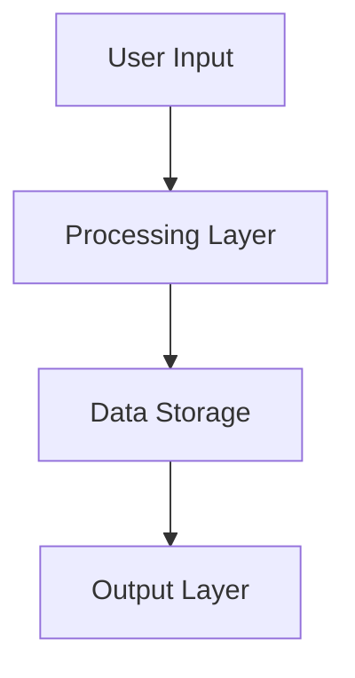

# SPARC Exercise Template
## Standardized Format for Hands-On Learning Activities

### Template Overview
**Purpose:** Create consistent, engaging, and effective hands-on exercises
**Scope:** Programming exercises, challenges, and practical activities
**Audience:** Instructors, content creators, and educational designers

---

## Exercise Header

### Exercise Metadata
```yaml
---
exercise_id: "[unique-exercise-id]"
title: "[Exercise Title]"
category: "[coding|design|analysis|troubleshooting|project]"
difficulty: "[beginner|intermediate|advanced|expert]"
estimated_time: "[X minutes/hours]"
learning_objectives:
  - "Specific skill or concept to master"
  - "Practical outcome to achieve"
  - "Understanding to demonstrate"
prerequisites:
  - "Required knowledge or skill"
  - "Previous exercises to complete"
tools_required:
  - "Development tools needed"
  - "Software dependencies"
related_concepts:
  - "Core SPARC concept 1"
  - "Core SPARC concept 2"
assessment_type: "[auto-graded|peer-review|instructor-review|self-assessment]"
---
```

### Exercise Introduction
```markdown
# [Exercise Title]
## [Brief Description of What Students Will Build/Solve]

### Learning Goals
By completing this exercise, you will be able to:
- [Specific, measurable learning outcome 1]
- [Specific, measurable learning outcome 2]  
- [Specific, measurable learning outcome 3]

### Real-World Context
[Brief explanation of how this exercise relates to actual development scenarios]

### Time Investment
- **Estimated Time:** [X minutes/hours]
- **Difficulty Level:** [Visual indicator + description]
- **Success Rate:** [X% of students complete successfully]
```

---

## Exercise Structure Templates

### Coding Exercise Template
```markdown
## Coding Challenge: [Challenge Name]

### Problem Statement
[Clear, specific description of what needs to be built or solved]

### Requirements
**Functional Requirements:**
1. [Specific functionality requirement 1]
2. [Specific functionality requirement 2]
3. [Specific functionality requirement 3]

**Technical Requirements:**
- **Language/Framework:** [Specify exactly what to use]
- **Architecture:** [Any architectural constraints]
- **Performance:** [Performance requirements if applicable]
- **Testing:** [Testing requirements]

### Starter Code
**Project Structure:**
```
project-name/
├── src/
│   ├── index.js          # Main entry point
│   ├── components/       # Your components here
│   └── utils/           # Utility functions
├── tests/
│   └── example.test.js  # Test examples
├── package.json
└── README.md
```

**Initial Implementation:**
```javascript
// src/index.js - Starting point
// TODO: Implement the required functionality

/**
 * [Function description]
 * @param {type} param1 - Description
 * @param {type} param2 - Description
 * @returns {type} Description
 */
function startHere(param1, param2) {
  // Your implementation goes here
  throw new Error('Not implemented yet');
}

export { startHere };
```

### Input/Output Examples
**Example 1:**
```javascript
// Input
const input1 = /* example input */;

// Expected Output
const expectedOutput1 = /* expected result */;
```

**Example 2:**
```javascript
// Input
const input2 = /* different example */;

// Expected Output
const expectedOutput2 = /* expected result */;
```

### Edge Cases to Consider
- [Edge case 1 with explanation]
- [Edge case 2 with explanation]
- [Edge case 3 with explanation]
```

### Design Exercise Template
```markdown
## Design Challenge: [Challenge Name]

### Design Brief
[Comprehensive description of the design problem]

### User Story
**As a** [user type]
**I want** [functionality]
**So that** [benefit/value]

### Design Requirements
**User Experience:**
- [UX requirement 1]
- [UX requirement 2]
- [UX requirement 3]

**Technical Constraints:**
- [Technical limitation 1]
- [Technical limitation 2]
- [Technical limitation 3]

**Business Requirements:**
- [Business constraint 1]
- [Business constraint 2]

### Deliverables
1. **Architecture Diagram:** [Specific format and detail level]
2. **Component Design:** [What components and their interactions]
3. **Data Flow Diagram:** [How data moves through the system]
4. **Implementation Plan:** [High-level steps for development]

### Design Template


**Use this as a starting point and expand based on your design**
```

### Analysis Exercise Template
```markdown
## Analysis Challenge: [Challenge Name]

### Scenario
[Detailed description of the situation to analyze]

### Analysis Framework
Use the following structure for your analysis:

1. **Problem Identification**
   - What are the key issues?
   - What are the root causes?
   - What are the symptoms vs. underlying problems?

2. **Option Evaluation**
   - What are possible solutions?
   - What are the trade-offs of each option?
   - What are the costs and benefits?

3. **Recommendation**
   - What is your recommended approach?
   - Why is this the best option?
   - What are the implementation considerations?

### Data Provided
[Include relevant data, code samples, metrics, or other information needed for analysis]

### Analysis Template
**Problem Statement:**
[Your analysis of the core problem]

**Options Considered:**
| Option | Pros | Cons | Feasibility |
|--------|------|------|-------------|
| Option 1 | | | |
| Option 2 | | | |
| Option 3 | | | |

**Recommendation:**
[Your detailed recommendation with justification]
```

---

## Assessment & Feedback Templates

### Auto-Graded Assessment
```markdown
## Automated Testing

### Test Suite
Your solution will be evaluated against these tests:

**Unit Tests (40%):**
- Test basic functionality
- Verify correct input/output handling
- Check edge case behavior

**Integration Tests (30%):**
- Test component interactions
- Verify data flow
- Check system behavior

**Performance Tests (20%):**
- Measure execution time
- Test memory usage
- Verify scalability

**Code Quality (10%):**
- Check code style
- Verify documentation
- Test maintainability

### Running Tests Locally
```bash
# Install dependencies
npm install

# Run all tests
npm test

# Run tests with coverage
npm run test:coverage

# Run performance tests
npm run test:performance
```

### Submission Instructions
1. **Complete implementation** in the provided files
2. **Verify all tests pass** locally
3. **Submit via** [submission method]
4. **Include documentation** of your approach

### Grading Rubric
| Category | Excellent (4) | Good (3) | Satisfactory (2) | Needs Work (1) |
|----------|---------------|----------|------------------|----------------|
| Functionality | All requirements met perfectly | Most requirements met | Basic requirements met | Missing key functionality |
| Code Quality | Clean, well-documented, efficient | Generally clean and clear | Adequate structure | Poor structure or documentation |
| Testing | Comprehensive test coverage | Good test coverage | Basic tests included | Limited or no testing |
| Innovation | Creative, elegant solution | Good problem-solving approach | Standard approach | Minimal problem-solving |
```

### Peer Review Assessment
```markdown
## Peer Review Process

### Review Guidelines
When reviewing a peer's work, evaluate these aspects:

**Technical Implementation (40%):**
- Does the solution work correctly?
- Is the code well-structured and readable?
- Are best practices followed?

**Problem-Solving Approach (30%):**
- Is the approach logical and efficient?
- Are edge cases handled appropriately?
- Is the solution scalable?

**Communication (20%):**
- Is the code well-documented?
- Are variable and function names clear?
- Is the overall approach explained?

**Innovation (10%):**
- Are there creative aspects to the solution?
- Does it go beyond minimum requirements?
- Are there novel insights or approaches?

### Review Template
**Reviewer:** [Your name]
**Reviewee:** [Peer's name]
**Date:** [Review date]

**Strengths:**
- [What did they do well?]
- [What can others learn from this?]
- [What was particularly impressive?]

**Areas for Improvement:**
- [What could be enhanced?]
- [What alternative approaches might work?]
- [What best practices could be applied?]

**Specific Feedback:**
- **Line X:** [Specific comment about code]
- **Function Y:** [Specific suggestion]
- **Overall Architecture:** [Structural feedback]

**Questions for the Author:**
- [What was your reasoning for approach X?]
- [Have you considered alternative Y?]
- [How would you handle scenario Z?]

**Overall Rating:** [1-5 scale with justification]
```

### Self-Assessment Template
```markdown
## Self-Reflection

### Implementation Review
**What I Built:**
[Describe your solution and approach]

**Key Decisions:**
- **Decision 1:** [Why you made this choice]
- **Decision 2:** [Alternative considered and why rejected]
- **Decision 3:** [Trade-offs involved]

**Challenges Encountered:**
- **Challenge 1:** [How you overcame it]
- **Challenge 2:** [What you learned]
- **Challenge 3:** [What you would do differently]

### Learning Assessment
**New Concepts Learned:**
- [Concept 1 and how you'll apply it]
- [Concept 2 and its importance]
- [Concept 3 and related areas to explore]

**Skills Developed:**
- [Technical skill and proficiency level]
- [Problem-solving improvement]
- [Communication or collaboration skills]

**Next Steps:**
- [What you want to learn next]
- [How this connects to your goals]
- [Areas for continued practice]

### Quality Self-Check
Rate yourself on these criteria:

| Aspect | Self-Rating (1-5) | Evidence | Improvement Plan |
|--------|------------------|----------|------------------|
| Technical Accuracy | | | |
| Code Quality | | | |
| Problem-Solving | | | |
| Communication | | | |
| Effort/Engagement | | | |
```

---

## Support & Guidance Templates

### Hint System
```markdown
## Progressive Hints

Need some help? Use these hints progressively - try to solve as much as you can before looking at the next hint.

<details>
<summary>Hint 1: Getting Started</summary>

**Focus Area:** [What aspect of the problem to focus on first]

**Approach:** [High-level strategy without giving away solution]

**Key Question:** [Question to guide thinking]

</details>

<details>
<summary>Hint 2: Core Implementation</summary>

**Implementation Strategy:** [More specific guidance]

**Code Structure:** [Suggest how to organize the solution]

**Key Functions:** [What functions/methods might be needed]

</details>

<details>
<summary>Hint 3: Specific Guidance</summary>

**Algorithm/Pattern:** [Suggest specific approach or pattern]

**Code Snippet:** 
```javascript
// Example structure - fill in the details
function solutionApproach() {
  // Step 1: [What to do first]
  // Step 2: [What to do next]
  // Step 3: [How to complete]
}
```

</details>

<details>
<summary>Hint 4: Debugging Help</summary>

**Common Issues:**
- [Issue 1 and how to identify]
- [Issue 2 and how to fix]
- [Issue 3 and how to prevent]

**Debug Strategy:**
- [What to check first]
- [How to isolate problems]
- [Testing approach]

</details>
```

### Common Issues & Solutions
```markdown
## Troubleshooting Guide

### Setup Issues
**Problem:** [Common setup problem]
- **Symptoms:** [What students see]
- **Cause:** [Why this happens]
- **Solution:** [Step-by-step fix]
- **Prevention:** [How to avoid next time]

### Implementation Issues
**Problem:** [Common coding problem]
- **Example Error:**
  ```
  Error message that students typically see
  ```
- **Explanation:** [What this error means]
- **Fix:** [How to resolve it]
- **Learning Point:** [What this teaches]

### Conceptual Issues
**Problem:** [Common misunderstanding]
- **Misconception:** [What students think]
- **Reality:** [What's actually true]
- **Clarification:** [Clear explanation]
- **Example:** [Concrete example to illustrate]
```

### Getting Help
```markdown
## How to Get Help

### Before Asking for Help
1. **Re-read the requirements** - Make sure you understand what's being asked
2. **Check your work** - Compare your implementation to the examples
3. **Test systematically** - Isolate where the problem occurs
4. **Review hints** - Use the progressive hint system
5. **Check common issues** - Look at the troubleshooting guide

### When to Ask for Help
- You've been stuck for more than [X] minutes
- You've tried multiple approaches without success
- You have a specific technical question
- You want feedback on your approach before implementing

### How to Ask Effective Questions
**Include in your help request:**
- **What you're trying to accomplish**
- **What you've tried so far**
- **Specific error messages or unexpected behavior**
- **Relevant code snippets (not entire files)**
- **What you think might be causing the issue**

**Good Example:**
> I'm trying to implement the user authentication function, but I'm getting a "Cannot read property 'token' of undefined" error when I call validateUser(). I've checked that the user object exists, and I think the issue might be in how I'm accessing the nested token property. Here's the relevant code: [code snippet]. I've tried [specific attempts] but still getting the same error.

**Poor Example:**
> My code doesn't work. Can someone help?

### Getting Live Help
- **Office Hours:** [Schedule and access information]
- **Study Groups:** [How to find or form study groups]
- **Peer Support:** [Community forums or chat]
- **Instructor Support:** [When and how to contact]
```

---

## Extension & Enrichment

### Advanced Challenges
```markdown
## Going Beyond: Advanced Challenges

For students who complete the core exercise quickly or want additional challenge:

### Challenge 1: [Advanced Feature]
**Objective:** [What additional functionality to add]
**Complexity:** [Why this is more challenging]
**Hint:** [High-level guidance for approach]

### Challenge 2: [Optimization]
**Objective:** [Performance or efficiency improvement]
**Metrics:** [How to measure improvement]
**Approach:** [Suggested optimization strategies]

### Challenge 3: [Integration]
**Objective:** [Connect with other systems or concepts]
**Skills Required:** [Additional skills needed]
**Resources:** [Where to learn more]

### Challenge 4: [Creative Extension]
**Objective:** [Open-ended improvement or feature]
**Freedom:** [Areas where students can be creative]
**Sharing:** [How to share creative solutions with others]
```

### Real-World Applications
```markdown
## Industry Connections

### How Professionals Use This
[Real examples of how the concepts/skills from this exercise are used in industry]

### Career Relevance
**Job Roles:** [Specific roles that use these skills]
**Industries:** [Industries where this applies]
**Advancement:** [How mastering this helps career growth]

### Portfolio Development
**Portfolio Piece:** [How to present this work in a portfolio]
**Skill Demonstration:** [What specific skills this shows]
**Interview Preparation:** [How this might come up in interviews]

### Further Learning
**Next Skills:** [Related skills to develop]
**Advanced Topics:** [More complex applications]
**Specialization Areas:** [How this connects to specializations]
```

---

## Template Customization Guide

### Adapting for Different Exercise Types
**For Debugging Exercises:**
- Include broken code as starting point
- Add systematic debugging methodology
- Emphasize diagnostic skills

**For Design Exercises:**
- Focus on architecture and planning
- Include multiple valid solutions
- Emphasize trade-off analysis

**For Research Exercises:**
- Provide research framework
- Include evaluation criteria for sources
- Emphasize synthesis of information

### Difficulty Level Adjustments
**Beginner Modifications:**
- More detailed step-by-step guidance
- Additional examples and explanations
- Simpler success criteria

**Advanced Modifications:**
- Open-ended requirements
- Multiple solution approaches
- Performance optimization challenges

### Time Constraint Adaptations
**Short Exercises (15-30 minutes):**
- Single, focused objective
- Pre-written starter code
- Clear, narrow scope

**Long Exercises (2+ hours):**
- Multiple interconnected objectives
- Minimal starter code
- Broader scope with multiple components

---

## Quality Assurance Checklist

### Content Review
- [ ] Learning objectives are clear and measurable
- [ ] Instructions are complete and unambiguous
- [ ] All code examples have been tested
- [ ] Prerequisites are accurately specified
- [ ] Difficulty level is appropriate for target audience

### Technical Review
- [ ] All tools and dependencies are specified
- [ ] Code examples follow best practices
- [ ] Test cases cover edge cases
- [ ] Performance requirements are realistic
- [ ] Security considerations are addressed

### Educational Review
- [ ] Exercise aligns with learning objectives
- [ ] Progressive difficulty is appropriate
- [ ] Assessment methods match objectives
- [ ] Support materials are sufficient
- [ ] Extension activities provide appropriate challenge

### Accessibility Review
- [ ] Instructions accommodate different learning styles
- [ ] Alternative formats are available if needed
- [ ] Time estimates account for different skill levels
- [ ] Support resources are comprehensive
- [ ] Cultural sensitivity is considered